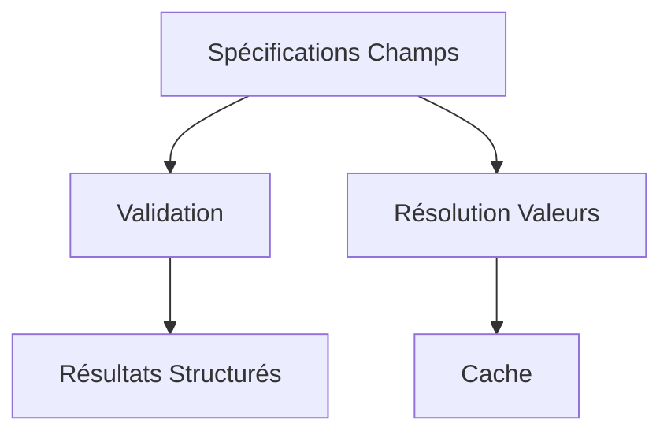

# Dynamic Input Field Specification Protocol (v2.1.0)

*Protocole agnostique pour décrire, valider et alimenter dynamiquement des champs de saisie – version 2 unifiée (atomic constraints + domaine de valeurs centralisé).* 

[](./PROTOCOL_SPECIFICATION.md)
[](./impl/typescript/)
[](./impl/java/)
[](./LICENSE)
[](./docs/CONTRIBUTING.md)
[](#)
[](./docs/MIGRATION_V1_V2.md)
[](./docs/IMPLEMENTATION_NOTES.md)
[](https://cyfko.github.io/input-spec/)

> La branche principale reflète la spécification **v2**. Le modèle v1 (composite constraints, `enumValues`) est **déprécié**. Voir `docs/MIGRATION_V1_V2.md`.

## 🎯 Vue d'ensemble

Définissez côté serveur les champs (métadonnées, contraintes, domaine de valeurs) et laissez les clients appliquer une validation déterministe et fournir une UX riche (autocomplete, pagination, filtrage) sans logique dupliquée.

---

## 🚀 Pourquoi choisir le protocole Dynamic Input Field Specification v2 ?

### Valeur ajoutée unique

- **Unification dynamique des domaines de valeurs**  
  Permet de décrire aussi bien des listes statiques (`INLINE`) que des domaines dynamiques (endpoints paginés, suggestions, recherche avancée multi-critères) via un unique champ `valuesEndpoint` au niveau du champ.  
  → *Impossible avec JSON Schema, OpenAPI, Zod, Yup, etc.*

- **Pipeline de validation déterministe et normatif**  
  L’ordre de validation est strictement défini : `required` → type → membership (si `valuesEndpoint.mode = CLOSED`) → contraintes atomiques ordonnées.  
  → *Assure la cohérence des erreurs et la reproductibilité cross-langages.*

- **Contraintes atomiques extensibles**  
  Chaque contrainte est atomique (`type` du registre, `params` dédiés), ce qui permet d’ajouter des règles métier ou des extensions custom sans casser la rétrocompatibilité.

- **Séparation stricte entre données, validation et UI**  
  Le protocole ne spécifie aucun rendu, mais fournit tous les hints nécessaires (`formatHint`, `errorMessage`, `description`) pour générer dynamiquement des interfaces riches, multi-plateformes.

- **Gestion native des domaines ouverts/fermés**  
  `valuesEndpoint.mode` distingue un domaine fermé (`CLOSED`) d’un domaine ouvert à suggestions (`SUGGESTIONS`), couvrant des cas avancés (tags, recherche utilisateur, etc.) sans hack.

- **Interopérabilité multi-langages et multi-frameworks**  
  La spec est conçue pour être consommée aussi bien côté backend (Java, Node, Python…) que frontend (React, Angular, Vue, Svelte…), sans duplication de logique.

- **Migration et évolutivité**  
  Migration mécanique v1→v2 prévue, extensibilité future (nouvelles contraintes, pagination, etc.) sans breaking change.

---


### 📎 [Liste des contraintes atomiques (Registry)](./PROTOCOL_SPECIFICATION.md#25-registry)

### 🔍 Recherche avancée : `searchParams` et `searchParamsSchema`

Depuis la version 2.1, le protocole permet de décrire des paramètres de recherche avancés pour les endpoints distants via :
- `searchParams` : objet clé/valeur transmis en query (GET) ou body (POST)
- `searchParamsSchema` : schéma JSON Schema décrivant chaque clé (type, description, enum, etc.)

**Exemple :**
```json
{
  "protocol": "HTTPS",
  "uri": "/api/items",
  "method": "POST",
  "searchParams": { "name": "foo", "status": "active" },
  "searchParamsSchema": {
    "type": "object",
    "properties": {
      "name": {
        "type": "string",
        "description": "Nom de l’item à rechercher (recherche partielle autorisée)"
      },
      "status": {
        "type": "string",
        "description": "Statut de l’item (ex: active, archived, pending)",
        "enum": ["active", "archived", "pending"]
      }
    },
    "required": ["name"]
  },
  "paginationStrategy": "PAGE_NUMBER",
  "responseMapping": { "dataField": "data" }
}
```

Ce mécanisme permet la génération automatique d’UI de recherche, la validation locale, et l’interopérabilité avec des agents IA (MCP, etc.).

---

### 🧠 Utilité dans les protocoles de modèles d’IA (ex. MCP)

- **Configuration dynamique de modèles d’IA**  
  Permet de décrire et valider dynamiquement les hyperparamètres, options et choix de pipeline d’un modèle (LLM, vision, etc.), avec gestion des domaines évolutifs (datasets, stratégies, etc.).

- **Interopérabilité multi-agent et multi-plateforme**  
  Facilite la génération automatique d’interfaces de configuration et la validation locale dans des orchestrateurs, notebooks, UI web, agents CLI, etc.

- **Gestion des domaines contextuels et évolutifs**  
  Grâce à `valuesEndpoint`, les listes de choix (datasets, modèles, devices…) sont toujours à jour et contextualisées.

- **Validation déterministe et auditabilité**  
  Les erreurs sont précises, localisées et cohérentes entre UI, API et backend ; la spec formelle facilite l’audit et la reproductibilité des runs.

- **Extensibilité et versioning**  
  Ajout/retrait de paramètres sans breaking change, versionnement des specs, adaptation aux évolutions des modèles.

---

### 🥊 Comparatif avec les standards existants

| Critère / Solution         | input-spec v2 | JSON Schema | OpenAPI | Zod/Yup/Ajv | Formik/RHF | MCP custom |
|---------------------------|:-------------:|:-----------:|:-------:|:-----------:|:----------:|:----------:|
| **Domaines dynamiques**   |      ✅       |     ❌      |   ❌    |     ❌      |     ❌     |     ⚠️     |
| **Enum + suggestions**    |      ✅       |     ❌      |   ❌    |     ❌      |     ❌     |     ⚠️     |
| **Pipeline normatif**     |      ✅       |     ❌      |   ❌    |     ❌      |     ❌     |     ❌     |
| **Interop multi-langage** |      ✅       |     ✅      |   ✅    |     ❌      |     ❌     |     ⚠️     |
| **Extensible/versionné**  |      ✅       |     ⚠️      |   ⚠️    |     ✅      |     ❌     |     ⚠️     |
| **UI hints**              |      ✅       |     ⚠️      |   ⚠️    |     ❌      |     ⚠️     |     ❌     |
| **Migration v1→v2**       |      ✅       |     ❌      |   ❌    |     ❌      |     ❌     |     ❌     |

---

### 🎯 En résumé

Le protocole v2 apporte une **vraie valeur ajoutée** pour :
- Générer dynamiquement des formulaires riches, multi-plateformes, avec domaines de valeurs distants ou évolutifs.
- Offrir un modèle extensible, transmissible, normatif, là où les standards existants sont trop statiques ou trop couplés à une stack.
- Servir de socle pour la configuration dynamique, l’orchestration et l’auditabilité des modèles d’IA (MCP, MLOps, etc.).

> Ce protocole complète plutôt qu’il ne remplace ces outils : vous pouvez générer plus tard un JSON Schema dérivé pour du gating API.


## Le problème résolu

```ts
// ❌ Avant : Logique dupliquée et incohérente
const validateEmailA = (email:string) => /^[^@]+@[^@]+\.[^@]+$/.test(email);
const validateEmailB = (email:string) => email.includes('@'); // Différent !
// ✅ Après : Spécification centrale
const emailFieldSpec = {
  constraints: [{ name: 'pattern', type: 'pattern', params: { regex: '^[^@]+@[^@]+\\.[^@]+$' }, errorMessage: 'Format email requis' }]
};
```

## ✨ Fonctionnalités clés (v2)

| Fonctionnalité         | Description                                                    | Statut  |
|------------------------|----------------------------------------------------------------|---------|
| Modèle unifié          | Champ = métadonnées + contraintes atomiques + `valuesEndpoint` | Stable  |
| Pipeline validation    | REQUIRED → TYPE → MEMBERSHIP → CONTRAINTES ordonnées           | Stable  |
| Erreurs structurées   | Nom de contrainte + message + index multi           | Stable              |
| Legacy adapter        | Traduction v1 → v2 (TS uniquement)                  | Stable (déprécié)   |
| Coercion douce        | Conversion nombre, booléen, date epoch (TS)         | Extension           |
| Short‑circuit         | Arrêt sur première erreur (Java)                    | Extension           |
| Hints performance     | `debounceMs`, stratégies cache côté client          | Stable              |
| Extensibilité         | `custom` + futurs types                             | Stable              |

> Les éléments "Extension" ne sont pas normatifs (hors cœur protocole) et sont documentés dans `docs/IMPLEMENTATION_NOTES.md`.

---

## 🚀 Exemple rapide (v2 pur)

### 1. Spécification d’un champ (serveur)
```json
{
  "displayName": "Assigné à",
  "description": "Sélection utilisateur (autocomplete)",
  "dataType": "STRING",
  "expectMultipleValues": false,
  "required": true,
  "valuesEndpoint": {
    "protocol": "HTTPS",
    "uri": "/api/users",
    "searchField": "name",
    "paginationStrategy": "PAGE_NUMBER",
    "mode": "CLOSED",
    "debounceMs": 300,
    "responseMapping": { "dataField": "data" },
    "requestParams": { "pageParam": "page", "limitParam": "limit", "searchParam": "q", "defaultLimit": 20 }
  },
  "constraints": [
    { "name": "syntax", "type": "pattern", "params": { "regex": "^[A-Za-z0-9_]+$" }, "errorMessage": "Identifiant invalide" }
  ]
}
```

### 2. Validation côté client (TypeScript)
```typescript
import { FieldValidator } from '@cyfko/input-spec';
const validator = new FieldValidator();
const result = await validator.validate(fieldSpec, selectedUserId);
if(!result.isValid) console.log(result.errors); // Affiche les erreurs si la validation échoue
```

### 💡 Hello World minimal
```typescript
import { FieldValidator } from '@cyfko/input-spec';
const spec = {
  displayName: 'Code pays', dataType: 'STRING', required: true,
  expectMultipleValues: false,
  constraints: [{ name: 'iso', type: 'pattern', params: { regex: '^[A-Z]{2}$' }, errorMessage: 'Format ISO2 requis' }]
};
const validator = new FieldValidator();
console.log(await validator.validate(spec, 'FR').isValid); // true
console.log(await validator.validate(spec, 'France').errors[0]); // { constraintName: 'iso', message: 'Format ISO2 requis' }
```

### 🧾 Exemple de ValidationResult (multi-valeurs)
```json
{
  "isValid": false,
  "errors": [
    { "constraintName": "iso", "message": "Format ISO2 requis", "index": 1 },
    { "constraintName": "iso", "message": "Format ISO2 requis", "index": 3 }
  ]
}
```

### 3. Résolution des valeurs (autocomplete)
```typescript
import { ValuesResolver, FetchHttpClient, MemoryCacheProvider } from '@cyfko/input-spec';
const resolver = new ValuesResolver(new FetchHttpClient(), new MemoryCacheProvider());
const { values } = await resolver.resolveValues(fieldSpec.valuesEndpoint!, { search: 'john', page: 1 });
```

---

## 📚 Documentation

| Niveau | Guide | Contenu |
|--------|-------|---------|
| Débutant | `docs/QUICK_START.md` | Premier champ et validation |
| Intermédiaire | `docs/INTERMEDIATE_GUIDE.md` | Composition, multi-champs |
| Expert | `docs/EXPERT_GUIDE.md` | Architecture interne |

### 📖 Référence

- [Spécification](./PROTOCOL_SPECIFICATION.md)
- [Migration v1→v2](./docs/MIGRATION_V1_V2.md)
- [Notes implémentation](./docs/IMPLEMENTATION_NOTES.md)
- [FAQ](./docs/FAQ.md)
- [Contribution](./docs/CONTRIBUTING.md)

---

## 🛠️ Implémentations

### TypeScript / JavaScript
```bash
npm install @cyfko/input-spec
```

### Java (Maven)
```xml
<dependency>
  <groupId>io.github.cyfko</groupId>
  <artifactId>input-spec</artifactId>
  <version>2.0.0</version>
</dependency>
```

### Statut

| Langage | Validation | Résolution valeurs | Cache | Tests | Statut |
|---------|------------|--------------------|-------|-------|--------|
| TypeScript | ✅ (atomic, membership) | ✅ (INLINE + remote hints) | ✅ mémoire | ✅ | Stable |
| Java | ✅ (atomic) | Partiel (remote hors scope) | 🚧 | ✅ | Beta |
| Python | Planifié | - | - | - | Backlog |
| C# | Planifié | - | - | - | Backlog |

---

## 🎪 Exemples

- Formulaire complet : `impl/typescript/examples/complete-form.ts`
- Valeurs dynamiques : `impl/typescript/examples/dynamic-values.ts`
- FAQ scénarios : `docs/FAQ.md`

---

## 🏗️ Architecture (vue conceptuelle)



---

## 🎯 Cas d'usage

Parfait pour : multi-formulaires, multi-clients, validation métier riche, configuration dynamique. Moins utile pour micro-apps statiques.

---

## 🚀 Roadmap (post 2.0.0)

| Version | Objectifs | Statut |
|---------|-----------|--------|
| 2.0.x | Corrections mineures, alignement Java (minLength single) | En cours |
| 2.1.0 | Génération JSON Schema, membership strict remote, `collectionSize` | Planifié |
| 2.x | I18n messages, contraintes email/uuid natives | Backlog |
| 3.0.0 | Retrait legacy adapter v1 (TS) | Prévision |

---

## 🤝 Contribution

Guide : `docs/CONTRIBUTING.md` – tests, implémentations supplémentaires, exemples réels bienvenus.

---

## 📊 Observabilité communautaire

- Stars / Forks / Issues : onglets GitHub
- Contributions prioritaires : tests de conformité multi-langages, adaptateurs frameworks

---

## 📄 Licence

Licence MIT – voir `LICENSE`.

---

## 🔗 Liens

- [Doc site](https://cyfko.github.io/input-spec/)
- [Issues](../../issues)
- [Discussions](../../discussions)
- [Releases](../../releases)
- [Changelog TypeScript](./impl/typescript/CHANGELOG.md)
- [Changelog Java](./impl/java/CHANGELOG.md)

**Fait avec ❤️ par la communauté**

**Version protocole**: 2.1.0 • **Dernière mise à jour**: Octobre 2025