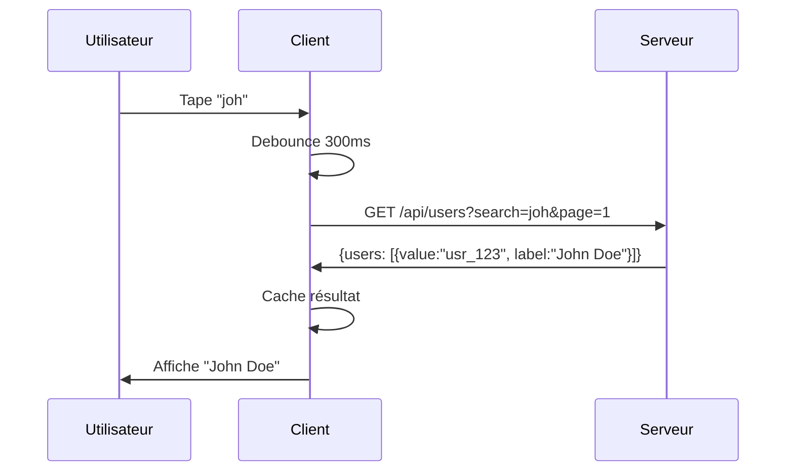
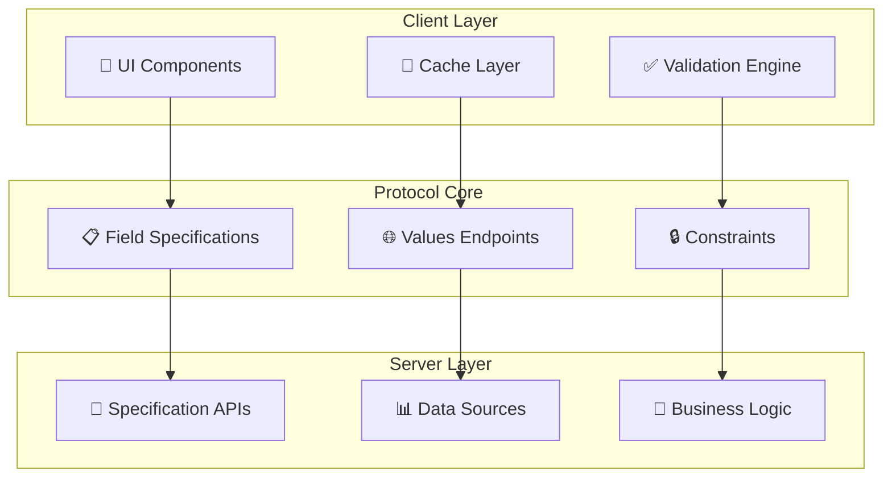

# Dynamic Input Field Specification Protocol

*Un protocole moderne et agnostique pour des champs de formulaire intelligents et adaptatifs*

[](https://cyfko.github.io/input-spec/)
[](./impl/typescript/)
[](./impl/java/)
[](./LICENSE)
[](./docs/CONTRIBUTING.md)

## 🎯 Vue d'ensemble

Ce protocole permet aux développeurs de créer des champs de formulaire intelligents qui s'adaptent automatiquement selon les spécifications fournies par le serveur. Il élimine le besoin de coder en dur la logique des champs et permet des expériences de formulaire cohérentes et maintenables.

### Le problème résolu

```typescript
// ❌ Avant : Logique dupliquée et incohérente
// Client A
const validateEmail = (email) => /^[^@]+@[^@]+\.[^@]+$/.test(email);
// Client B  
const validateEmail = (email) => email.includes('@'); // 😱 Différent !
// Serveur
const validateEmail = (email) => /* Encore une autre regex */;
```

```typescript
// ✅ Après : Source unique de vérité
// Serveur définit la spécification
const emailFieldSpec = {
  displayName: "Email",
  dataType: "STRING", 
  constraints: [{
    name: "email",
    pattern: "^[a-zA-Z0-9._%+-]+@[a-zA-Z0-9.-]+\\.[a-zA-Z]{2,}$"
  }]
};

// Tous les clients utilisent la même validation
const result = await validator.validate(emailFieldSpec, userEmail);
```

## ✨ Fonctionnalités clés

- **🌐 Agnostique technologique** - Fonctionne avec tout framework front/back
- **⚡ Validation dynamique** - Validation temps réel avec règles serveur
- **🔍 Sources de valeurs intelligentes** - Recherche, pagination, cache automatiques
- **🛡️ Type-safe** - Typage fort pour toutes les spécifications
- **🔧 Extensible** - Architecture plugin pour logique personnalisée
- **📊 Optimisé performance** - Debouncing, cache et batching intégrés

## 🚀 Exemple rapide

### Champ avec recherche utilisateur et validation

**🖥️ Côté serveur :**
```json
{
  "displayName": "Assigné à",
  "dataType": "STRING",
  "required": true,
  "constraints": [{
    "name": "user_validation",
    "valuesEndpoint": {
      "uri": "/api/users",
      "searchField": "name",
      "paginationStrategy": "PAGE_NUMBER",
      "debounceMs": 300,
      "responseMapping": { "dataField": "users" }
    }
  }]
}
```

**💻 Côté client :**
```typescript
// Validation automatique
const validator = new FieldValidator();
const result = await validator.validate(fieldSpec, selectedUserId);

// Recherche avec cache et debouncing
const resolver = new ValuesResolver(httpClient, cache);
const users = await resolver.resolveValues(valuesEndpoint, { 
  search: "john", 
  page: 1 
});
```

**🔄 Flux automatique :**


## 📚 Documentation complète

### 🎯 Par niveau d'expertise

| Niveau | Guide | Temps | Contenu |
|--------|--------|--------|---------|
| **Débutant** | [🚀 Démarrage rapide](./docs/QUICK_START.md) | 5 min | Premier champ intelligent |
| **Intermédiaire** | [🎓 Guide intermédiaire](./docs/INTERMEDIATE_GUIDE.md) | 30 min | Formulaires complexes, optimisations |
| **Expert** | [🔧 Guide expert](./docs/EXPERT_GUIDE.md) | 2h | Architecture interne, contributions |

### 📖 Documentation de référence

- **[📋 Spécification protocole](./PROTOCOL_SPECIFICATION.md)** - Documentation technique complète
- **[❓ FAQ et scénarios réels](./docs/FAQ.md)** - Questions fréquentes avec exemples concrets
- **[🤝 Guide de contribution](./docs/CONTRIBUTING.md)** - Comment participer au projet

## 🛠️ Implémentations disponibles

### TypeScript/JavaScript
```bash
npm install @cyfko/input-spec
```

### Java (Maven)
```xml
<dependency>
    <groupId>io.github.cyfko</groupId>
    <artifactId>input-spec</artifactId>
    <version>1.0.0</version>
</dependency>
```

### Statut des implémentations

| Langage | Validation | Résolution valeurs | Cache | Tests | Status |
|---------|------------|-------------------|--------|--------|--------|
| **TypeScript** | ✅ | ✅ | ✅ | ✅ | **Stable** |
| **Java** | ✅ | 🚧 | 🚧 | ✅ | **Beta** |
| **Python** | 📋 | 📋 | 📋 | 📋 | *Planifié* |
| **C#** | 📋 | 📋 | 📋 | 📋 | *Planifié* |

## 🎪 Exemples concrets

### Scénarios réels implémentés

1. **[Formulaire e-commerce](./impl/typescript/examples/complete-form.ts)**
   - Validation adresse avec géocodage
   - Sélection produits avec recherche
   - Validation carte de crédit

2. **[Application RH](./docs/FAQ.md#scénario-2-application-rh---formulaire-dembauche)**
   - Validation compétences candidat
   - Vérification antécédents
   - Scoring automatique

3. **[Système de tickets](./impl/typescript/examples/dynamic-values.ts)**
   - Assignation utilisateurs
   - Catégorisation automatique
   - Escalade conditionnelle

## 🏗️ Architecture



## 🎯 Cas d'usage idéaux

### ✅ Parfait pour :
- Applications avec **nombreux formulaires**
- Systèmes **multi-clients** (web, mobile, API)
- Besoins de **cohérence** entre équipes
- **Validation métier complexe**
- Formulaires **adaptatifs** et configurables

### ❌ Probablement pas nécessaire :
- Applications avec **< 5 formulaires** 
- Formulaires **ultra-spécifiques** sans patterns
- Contrôle **total manuel** préféré
- **Pas de contrôle** du backend

## 🚀 Roadmap

### ✅ Version 1.0 (Actuelle)
- Protocole stabilisé
- Implémentations TypeScript et Java
- Documentation complète
- Exemples d'intégration

### 🚧 Version 1.1 (En cours)
- Client HTTP Java complet
- Adaptateurs React/Vue/Angular
- Métriques de performance
- Tests cross-browser

### 📋 Version 2.0 (Planifiée)
- Validation conditionnelle avancée
- Internationalisation native  
- Synchronisation temps réel
- SDK Python et C#

## 🤝 Contribuer

Nous accueillons toutes les contributions ! 

**Types de contributions recherchées :**
- 🐛 Bugs et améliorations
- 💡 Nouvelles fonctionnalités
- 📖 Documentation et traductions
- 🧪 Tests et exemples
- 🔌 Adaptateurs frameworks

👉 **[Guide de contribution complet](./docs/CONTRIBUTING.md)**

## 📊 Métriques du projet

- ⭐ **Stars GitHub** : [Votre support compte !](../../stargazers)
- 🍴 **Forks** : [Contribuez au projet](../../network/members)  
- 🐛 **Issues ouvertes** : [Aidez-nous à résoudre](../../issues)
- 💬 **Discussions actives** : [Rejoignez la communauté](../../discussions)

## 📄 Licence

Ce projet est sous licence MIT - voir le fichier [LICENSE](./LICENSE) pour les détails.

## 🔗 Liens utiles

- **[📖 Documentation complète](https://cyfko.github.io/input-spec/)** - Site de documentation
- **[🐛 Issues](../../issues)** - Bugs et demandes de fonctionnalités  
- **[💬 Discussions](../../discussions)** - Questions et échanges communauté
- **[🚀 Releases](../../releases)** - Dernières versions et changelog
- **[📊 Projets](../../projects)** - Roadmap et planning

---

**Fait avec ❤️ par la communauté des développeurs**

*Dernière mise à jour : Octobre 2025*

## 🎯 Overview

The Dynamic Input Field Specification Protocol enables applications to:
- Define input field specifications at runtime
- Understand value constraints and sources without hardcoding
- Enable smart form fields with auto-completion and validation
- Support searchable, paginated value selection
- Maintain cross-language interoperability

## 📋 Protocol Specification

The complete protocol specification is available in [`PROTOCOL_SPECIFICATION.md`](./PROTOCOL_SPECIFICATION.md).

### Key Features
- **Technology-agnostic**: Works with any programming language or framework
- **Dynamic constraints**: Define validation rules at runtime
- **Value sources**: Support for remote data fetching with search and pagination
- **Type safety**: Strong typing for field specifications and constraints
- **Extensible**: Easy to add new constraint types and value sources

## 🚀 Implementations

### TypeScript Implementation (Production Ready)
- **Status**: ✅ **Published** - `input-field-spec-ts@1.0.0`
- **Location**: [`docs/typescript/`](https://cyfko.github.io/input-spec/typescript/)
- **Features**: 
  - Zero dependencies
  - Framework integration (Angular, React, Vue)
  - Comprehensive test suite (58 tests)
  - Complete TypeScript support

```bash
npm install input-field-spec-ts
```

**Quick Start:**
```typescript
import { InputFieldSpec, FieldValidator } from 'input-field-spec-ts';

const emailField: InputFieldSpec = {
  displayName: "Email Address",
  dataType: "STRING",
  expectMultipleValues: false,
  required: true,
  constraints: [
    { name: "email", type: "email", message: "Must be a valid email" },
    { name: "maxLength", type: "maxLength", value: 100 }
  ]
};

const validator = new FieldValidator();
const result = validator.validate("user@example.com", emailField);
```

### Other Implementations
- **Java**: 🔄 *Planned*
- **Python**: 🔄 *Planned*
- **C#**: 🔄 *Planned*
- **Go**: 🔄 *Planned*

## 📖 Documentation

### Protocol Documentation
- [**Protocol Specification**](./PROTOCOL_SPECIFICATION.md) - Complete protocol definition
- [**Examples**](./PROTOCOL_SPECIFICATION.md#examples) - Real-world usage examples

### TypeScript Implementation
- [**README**](https://cyfko.github.io/input-spec/typescript/) - Getting started guide
- [**API Reference**](https://cyfko.github.io/input-spec/typescript/API) - Complete API documentation
- [**Framework Integration**](https://cyfko.github.io/input-spec/typescript/FRAMEWORK_INTEGRATION) - Angular, React, Vue guides
- [**Performance Guide**](https://cyfko.github.io/input-spec/typescript/PERFORMANCE) - Optimization techniques
- [**Architecture**](https://cyfko.github.io/input-spec/typescript/ARCHITECTURE) - Design decisions

## 🏗️ Core Concepts

### InputFieldSpec
Defines a smart input field with constraints and value sources:
```json
{
  "displayName": "Product Category",
  "dataType": "STRING",
  "expectMultipleValues": false,
  "required": true,
  "constraints": [
    { "name": "minLength", "type": "minLength", "value": 2 }
  ],
  "valuesEndpoint": {
    "url": "/api/categories",
    "searchParam": "query"
  }
}
```

### Constraint Types
- **Validation**: `required`, `minLength`, `maxLength`, `pattern`, `email`
- **Numeric**: `min`, `max`, `step`
- **Date/Time**: `minDate`, `maxDate`
- **Custom**: Extensible constraint system

### Value Sources
- **Static lists**: Predefined values
- **Remote endpoints**: RESTful APIs with search and pagination
- **Dependent fields**: Values based on other field selections

## 🌐 Framework Support

The TypeScript implementation provides native adapters for:
- **Angular**: HttpClient integration with dependency injection
- **React**: Axios adapter preserving interceptors
- **Vue.js**: Configurable HTTP client with composables
- **Vanilla JS**: Standard fetch-based implementation

## 📊 Use Cases

### Dynamic Forms
```typescript
// Form fields defined by server configuration
const formSpec = await fetch('/api/form-config/user-registration');
const fields = formSpec.fields.map(spec => createFormField(spec));
```

### Smart Autocomplete
```typescript
// Searchable product selection
const productField: InputFieldSpec = {
  displayName: "Product",
  dataType: "STRING",
  valuesEndpoint: {
    url: "/api/products/search",
    searchParam: "q",
    pageParam: "page"
  }
};
```

### Conditional Validation
```typescript
// Country-specific phone validation
const phoneField: InputFieldSpec = {
  displayName: "Phone Number",
  dataType: "STRING",
  constraints: [
    { 
      name: "pattern", 
      type: "pattern", 
      value: getPhonePatternForCountry(selectedCountry) 
    }
  ]
};
```

## 🤝 Contributing

We welcome contributions! Here's how you can help:

### Protocol Evolution
- Propose new constraint types
- Suggest API improvements
- Submit usage examples

### New Implementations
- Implement the protocol in other languages
- Follow the specification in `PROTOCOL_SPECIFICATION.md`
- Include comprehensive tests and documentation

### TypeScript Implementation
- Bug fixes and improvements
- Framework adapter enhancements
- Performance optimizations

## 📋 Roadmap

### Short Term
- [ ] Java implementation
- [ ] Python implementation
- [ ] Enhanced constraint types (file upload, geographic)
- [ ] Real-time validation WebSocket support

### Long Term
- [ ] Visual form builder
- [ ] Multi-language constraint messages
- [ ] Advanced caching strategies
- [ ] Integration with popular form libraries

## 📄 License

This project is licensed under the MIT License - see the [LICENSE](./LICENSE) file for details.

## 🔗 Links

- **npm Package**: [input-field-spec-ts](https://www.npmjs.com/package/input-field-spec-ts)
- **GitHub Repository**: [cyfko/input-spec](https://github.com/cyfko/input-spec)
- **Issues & Discussions**: [GitHub Issues](https://github.com/cyfko/input-spec/issues)

---

**Version**: 1.0.0 | **Updated**: October 2025