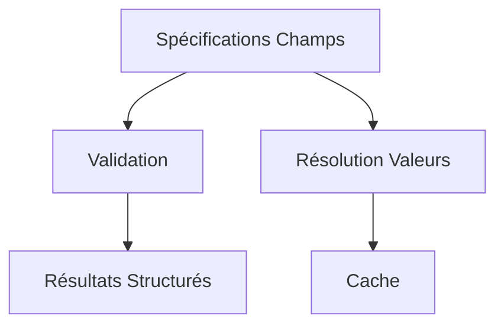

---
# Dynamic Input Field Specification Protocol (v2.1.0)

Comprehensive guide for client and server implementations of dynamic input fields.

[🌐 Choisir la langue / Select language](docs/LANGUAGE.md)

[](./PROTOCOL_SPECIFICATION.md)
[](./impl/typescript/)
[](./impl/java/)
[](./LICENSE)
[](./docs/CONTRIBUTING.md)
[](#)
[](./docs/MIGRATION_V1_V2.md)
[](./docs/IMPLEMENTATION_NOTES.md)
[](https://cyfko.github.io/input-spec/)

---

## Introduction

Ce protocole vise à standardiser la spécification, la validation et l’intégration des champs dynamiques dans les formulaires, pour tous types d’applications (web, mobile, IA, etc.). Il sert de socle pour la configuration dynamique, l’orchestration et l’auditabilité des modèles d’IA (MCP, MLOps, etc.).

> Ce protocole complète plutôt qu’il ne remplace ces outils : vous pouvez générer plus tard un JSON Schema dérivé pour du gating API.

---

## Problème résolu

```ts
// ❌ Avant : Logique dupliquée et incohérente
const validateEmailA = (email:string) => /^[^@]+@[^@]+\.[^@]+$/.test(email);
const validateEmailB = (email:string) => email.includes('@'); // Différent !
// ✅ Après : Spécification centrale
const emailFieldSpec = {
  constraints: [{ name: 'pattern', type: 'pattern', params: { regex: '^[^@]+@[^@]+\.[^@]+$' }, errorMessage: 'Format email requis' }]
};
```

---

## Fonctionnalités principales

| Fonctionnalité        | Description                                         | Statut              |
|-----------------------|-----------------------------------------------------|---------------------|
| Modèle unifié         | Champ = métadonnées + contraintes atomiques + `valuesEndpoint` | Stable  |
| Pipeline validation   | REQUIRED → TYPE → MEMBERSHIP → CONTRAINTES ordonnées           | Stable  |
| Erreurs structurées   | Nom de contrainte + message + index multi           | Stable              |
| Legacy adapter        | Traduction v1 → v2 (TS uniquement)                  | Stable (déprécié)   |
| Coercion douce        | Conversion nombre, booléen, date epoch (TS)         | Extension           |
| Short‑circuit         | Arrêt sur première erreur (Java)                    | Extension           |
| Hints performance     | `debounceMs`, stratégies cache côté client          | Stable              |
| Extensibilité         | `custom` + futurs types                             | Stable              |

---

## Extensions

> Les éléments "Extension" ne sont pas normatifs (hors cœur protocole) et sont documentés dans `docs/IMPLEMENTATION_NOTES.md`.

---

## Pour aller plus loin

- [Documentation complète](docs/)
- [Guide d’implémentation](docs/IMPLEMENTATION_NOTES.md)
- [FAQ](docs/FAQ.md)
- [Contribution](docs/CONTRIBUTING.md)

---

## Version & Updates

**Version protocole**: 2.1.0 • **Dernière mise à jour**: Octobre 2025
  "protocol": "HTTPS",
  "uri": "/api/items",
  "method": "POST",
  "searchParams": { "name": "foo", "status": "active" },
  "searchParamsSchema": {
    "type": "object",
    "properties": {
      "name": {
        "type": "string",
        "description": "Nom de l’item à rechercher (recherche partielle autorisée)"
      },
      "status": {
        "type": "string",
        "description": "Statut de l’item (ex: active, archived, pending)",
        "enum": ["active", "archived", "pending"]
      }
    },
    "required": ["name"]
  },
  "paginationStrategy": "PAGE_NUMBER",
  "responseMapping": { "dataField": "data" }
}
```

Ce mécanisme permet la génération automatique d’UI de recherche, la validation locale, et l’interopérabilité avec des agents IA (MCP, etc.).

---

### 🧠 Utilité dans les protocoles de modèles d’IA (ex. MCP)

- **Configuration dynamique de modèles d’IA**  
  Permet de décrire et valider dynamiquement les hyperparamètres, options et choix de pipeline d’un modèle (LLM, vision, etc.), avec gestion des domaines évolutifs (datasets, stratégies, etc.).

- **Interopérabilité multi-agent et multi-plateforme**  
  Facilite la génération automatique d’interfaces de configuration et la validation locale dans des orchestrateurs, notebooks, UI web, agents CLI, etc.

- **Gestion des domaines contextuels et évolutifs**  
  Grâce à `valuesEndpoint`, les listes de choix (datasets, modèles, devices…) sont toujours à jour et contextualisées.

- **Validation déterministe et auditabilité**  
  Les erreurs sont précises, localisées et cohérentes entre UI, API et backend ; la spec formelle facilite l’audit et la reproductibilité des runs.

- **Extensibilité et versioning**  
  Ajout/retrait de paramètres sans breaking change, versionnement des specs, adaptation aux évolutions des modèles.

---

### 🥊 Comparatif avec les standards existants

| Critère / Solution         | input-spec v2 | JSON Schema | OpenAPI | Zod/Yup/Ajv | Formik/RHF | MCP custom |
|---------------------------|:-------------:|:-----------:|:-------:|:-----------:|:----------:|:----------:|
| **Domaines dynamiques**   |      ✅       |     ❌      |   ❌    |     ❌      |     ❌     |     ⚠️     |
| **Enum + suggestions**    |      ✅       |     ❌      |   ❌    |     ❌      |     ❌     |     ⚠️     |
| **Pipeline normatif**     |      ✅       |     ❌      |   ❌    |     ❌      |     ❌     |     ❌     |
| **Interop multi-langage** |      ✅       |     ✅      |   ✅    |     ❌      |     ❌     |     ⚠️     |
| **Extensible/versionné**  |      ✅       |     ⚠️      |   ⚠️    |     ✅      |     ❌     |     ⚠️     |
| **UI hints**              |      ✅       |     ⚠️      |   ⚠️    |     ❌      |     ⚠️     |     ❌     |
| **Migration v1→v2**       |      ✅       |     ❌      |   ❌    |     ❌      |     ❌     |     ❌     |

---

### 🎯 En résumé

Le protocole v2 apporte une **vraie valeur ajoutée** pour :
- Générer dynamiquement des formulaires riches, multi-plateformes, avec domaines de valeurs distants ou évolutifs.
- Offrir un modèle extensible, transmissible, normatif, là où les standards existants sont trop statiques ou trop couplés à une stack.
- Servir de socle pour la configuration dynamique, l’orchestration et l’auditabilité des modèles d’IA (MCP, MLOps, etc.).

> Ce protocole complète plutôt qu’il ne remplace ces outils : vous pouvez générer plus tard un JSON Schema dérivé pour du gating API.


## Le problème résolu

```ts
// ❌ Avant : Logique dupliquée et incohérente
const validateEmailA = (email:string) => /^[^@]+@[^@]+\.[^@]+$/.test(email);
const validateEmailB = (email:string) => email.includes('@'); // Différent !
// ✅ Après : Spécification centrale
const emailFieldSpec = {
  constraints: [{ name: 'pattern', type: 'pattern', params: { regex: '^[^@]+@[^@]+\\.[^@]+$' }, errorMessage: 'Format email requis' }]
};
```

## ✨ Fonctionnalités clés (v2)

| Fonctionnalité         | Description                                                    | Statut  |
|------------------------|----------------------------------------------------------------|---------|
| Modèle unifié          | Champ = métadonnées + contraintes atomiques + `valuesEndpoint` | Stable  |
| Pipeline validation    | REQUIRED → TYPE → MEMBERSHIP → CONTRAINTES ordonnées           | Stable  |
| Erreurs structurées   | Nom de contrainte + message + index multi           | Stable              |
| Legacy adapter        | Traduction v1 → v2 (TS uniquement)                  | Stable (déprécié)   |
| Coercion douce        | Conversion nombre, booléen, date epoch (TS)         | Extension           |
| Short‑circuit         | Arrêt sur première erreur (Java)                    | Extension           |
| Hints performance     | `debounceMs`, stratégies cache côté client          | Stable              |
| Extensibilité         | `custom` + futurs types                             | Stable              |

> Les éléments "Extension" ne sont pas normatifs (hors cœur protocole) et sont documentés dans `docs/IMPLEMENTATION_NOTES.md`.

---

## 🚀 Exemple rapide (v2 pur)

### 1. Spécification d’un champ (serveur)
```json
{
  "displayName": "Assigné à",
  "description": "Sélection utilisateur (autocomplete)",
  "dataType": "STRING",
  "expectMultipleValues": false,
  "required": true,
  "valuesEndpoint": {
    "protocol": "HTTPS",
    "uri": "/api/users",
    "searchField": "name",
    "paginationStrategy": "PAGE_NUMBER",
    "mode": "CLOSED",
    "debounceMs": 300,
    "responseMapping": { "dataField": "data" },
    "requestParams": { "pageParam": "page", "limitParam": "limit", "searchParam": "q", "defaultLimit": 20 }
  },
  "constraints": [
    { "name": "syntax", "type": "pattern", "params": { "regex": "^[A-Za-z0-9_]+$" }, "errorMessage": "Identifiant invalide" }
  ]
}
```

### 2. Validation côté client (TypeScript)
```typescript
import { FieldValidator } from '@cyfko/input-spec';
const validator = new FieldValidator();
const result = await validator.validate(fieldSpec, selectedUserId);
if(!result.isValid) console.log(result.errors); // Affiche les erreurs si la validation échoue
```

### 💡 Hello World minimal
```typescript
import { FieldValidator } from '@cyfko/input-spec';
const spec = {
  displayName: 'Code pays', dataType: 'STRING', required: true,
  expectMultipleValues: false,
  constraints: [{ name: 'iso', type: 'pattern', params: { regex: '^[A-Z]{2}$' }, errorMessage: 'Format ISO2 requis' }]
};
const validator = new FieldValidator();
console.log(await validator.validate(spec, 'FR').isValid); // true
console.log(await validator.validate(spec, 'France').errors[0]); // { constraintName: 'iso', message: 'Format ISO2 requis' }
```

### 🧾 Exemple de ValidationResult (multi-valeurs)
```json
{
  "isValid": false,
  "errors": [
    { "constraintName": "iso", "message": "Format ISO2 requis", "index": 1 },
    { "constraintName": "iso", "message": "Format ISO2 requis", "index": 3 }
  ]
}
```

### 3. Résolution des valeurs (autocomplete)
```typescript
import { ValuesResolver, FetchHttpClient, MemoryCacheProvider } from '@cyfko/input-spec';
const resolver = new ValuesResolver(new FetchHttpClient(), new MemoryCacheProvider());
const { values } = await resolver.resolveValues(fieldSpec.valuesEndpoint!, { search: 'john', page: 1 });
```

---

## 📚 Documentation

| Niveau | Guide | Contenu |
|--------|-------|---------|
| Débutant | `docs/QUICK_START.md` | Premier champ et validation |
| Intermédiaire | `docs/INTERMEDIATE_GUIDE.md` | Composition, multi-champs |
| Expert | `docs/EXPERT_GUIDE.md` | Architecture interne |

### 📖 Référence

- [Spécification](./PROTOCOL_SPECIFICATION.md)
- [Migration v1→v2](./docs/MIGRATION_V1_V2.md)
- [Notes implémentation](./docs/IMPLEMENTATION_NOTES.md)
- [FAQ](./docs/FAQ.md)
- [Contribution](./docs/CONTRIBUTING.md)

---

## 🛠️ Implémentations

### TypeScript / JavaScript
```bash
npm install @cyfko/input-spec
```

### Java (Maven)
```xml
<dependency>
  <groupId>io.github.cyfko</groupId>
  <artifactId>input-spec</artifactId>
  <version>2.0.0</version>
</dependency>
```

### Statut

| Langage | Validation | Résolution valeurs | Cache | Tests | Statut |
|---------|------------|--------------------|-------|-------|--------|
| TypeScript | ✅ (atomic, membership) | ✅ (INLINE + remote hints) | ✅ mémoire | ✅ | Stable |
| Java | ✅ (atomic) | Partiel (remote hors scope) | 🚧 | ✅ | Beta |
| Python | Planifié | - | - | - | Backlog |
| C# | Planifié | - | - | - | Backlog |

---

## 🎪 Exemples

- Formulaire complet : `impl/typescript/examples/complete-form.ts`
- Valeurs dynamiques : `impl/typescript/examples/dynamic-values.ts`
- FAQ scénarios : `docs/FAQ.md`

---

## 🏗️ Architecture (vue conceptuelle)


```mermaid
graph TB
  SPEC[Spécifications Champs] --> VALID[Validation]
  SPEC --> VALUES[Résolution Valeurs]
  VALUES --> CACHE[Cache]
  VALID --> ERR[Résultats Structurés]
```

---

## 🎯 Cas d'usage

Parfait pour : multi-formulaires, multi-clients, validation métier riche, configuration dynamique. Moins utile pour micro-apps statiques.

---

## 🚀 Roadmap (post 2.0.0)

| Version | Objectifs | Statut |
|---------|-----------|--------|
| 2.0.x | Corrections mineures, alignement Java (minLength single) | En cours |
| 2.1.0 | Génération JSON Schema, membership strict remote, `collectionSize` | Planifié |
| 2.x | I18n messages, contraintes email/uuid natives | Backlog |
| 3.0.0 | Retrait legacy adapter v1 (TS) | Prévision |

---

## 🤝 Contribution

Guide : `docs/CONTRIBUTING.md` – tests, implémentations supplémentaires, exemples réels bienvenus.

---

## 📊 Observabilité communautaire

- Stars / Forks / Issues : onglets GitHub
- Contributions prioritaires : tests de conformité multi-langages, adaptateurs frameworks

---

## 📄 Licence

Licence MIT – voir `LICENSE`.

---

## 🔗 Liens

- [Doc site](https://cyfko.github.io/input-spec/)
- [Issues](../../issues)
- [Discussions](../../discussions)
- [Releases](../../releases)
- [Changelog TypeScript](./impl/typescript/CHANGELOG.md)
- [Changelog Java](./impl/java/CHANGELOG.md)

**Fait avec ❤️ par la communauté**

**Version protocole**: 2.1.0 • **Dernière mise à jour**: Octobre 2025