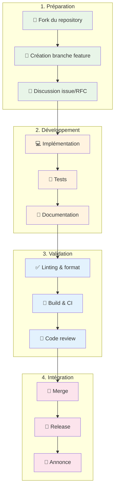

[🇫🇷 Français](./CONTRIBUTING.md) | [🇬🇧 English](./en/CONTRIBUTING.md)

# 🤝 Guide de contribution

*Comment participer au développement du Dynamic Input Field Specification Protocol*

## 🎯 Types de contributions recherchées

Nous accueillons avec enthousiasme tous types de contributions :

### 🐛 **Corrections de bugs et améliorations**
- Bugs dans les implémentations existantes
- Cas d'usage non couverts par la spécification
- Optimisations de performance
- Améliorations de l'expérience développeur

### 💡 **Nouvelles fonctionnalités**
- Extensions du protocole (rétrocompatibles)
- Nouveaux types de contraintes
- Adaptateurs pour frameworks populaires
- Intégrations avec des services externes

### 📖 **Documentation et exemples**
- Guides d'intégration spécialisés
- Exemples d'usage dans différents contextes
- Traductions de la documentation
- Tutoriels et articles de blog

### 🧪 **Tests et qualité**
- Tests de conformité pour nouvelles fonctionnalités
- Tests de performance et benchmarks
- Tests d'intégration avec frameworks populaires
- Validation cross-browser et cross-platform

## 🏗️ Architecture des contributions

### Processus de contribution général



## 🚀 Démarrage rapide

### 1. **Setup de l'environnement de développement**

```bash
# 1. Fork et clone
git clone https://github.com/YOUR_USERNAME/input-spec.git
cd input-spec

# 2. Installation des dépendances - TypeScript
cd impl/typescript
npm install
npm run build
npm test

# 3. Installation des dépendances - Java  
cd ../java
./mvnw clean install
./mvnw test

# 4. Vérification de la documentation
cd ../../docs
bundle install  # Jekyll pour GitHub Pages
bundle exec jekyll serve
```

### 2. **Structure du projet**

```
input-spec/
├── PROTOCOL_SPECIFICATION.md    # 📋 Spécification du protocole
├── docs/                        # 📖 Documentation GitHub Pages
│   ├── README.md                # Introduction générale
│   ├── QUICK_START.md           # Guide débutant
│   ├── INTERMEDIATE_GUIDE.md    # Guide intermédiaire
│   ├── EXPERT_GUIDE.md          # Guide expert
│   └── FAQ.md                   # Questions fréquentes
├── impl/                        # 💻 Implémentations
│   ├── typescript/              # Implémentation TypeScript
│   │   ├── src/                 # Code source
│   │   ├── examples/            # Exemples d'usage
│   │   └── __tests__/           # Tests
│   └── java/                    # Implémentation Java
│       ├── src/main/java/       # Code source
│       ├── src/test/java/       # Tests
│       └── examples/            # Exemples d'usage
└── tests/                       # 🧪 Tests de conformité
    ├── protocol-compliance/     # Tests protocole
    └── cross-language/          # Tests interopérabilité
```

### 3. **Conventions de développement**

#### **Commits**
Utilisez la convention [Conventional Commits](https://www.conventionalcommits.org/) :

```bash
# Nouveautés
feat(typescript): add debouncing support to ValuesResolver

# Corrections
fix(java): handle null values in FieldValidator 

# Documentation
docs: improve getting started guide

# Tests
test(protocol): add conformance tests for date validation

# Réusinage
refactor(cache): optimize memory usage in CacheProvider
```

#### **Branches**
```bash
# Nouvelles fonctionnalités
feature/typescript-react-adapter
feature/java-spring-integration

# Corrections de bugs
bugfix/validation-edge-cases
bugfix/cache-memory-leak

# Documentation
docs/api-reference-update
docs/french-translation

# Hotfixes
hotfix/security-vulnerability
```

## 📝 Guide de contribution par type

### 🔧 **Contribuer au protocole (spécification)**

#### Quand modifier le protocole ?
- ✅ Ajouter de nouveaux types de contraintes
- ✅ Étendre les capacités de pagination
- ✅ Améliorer l'interopérabilité cross-language
- ❌ Changes breaking (sauf version majeure)
- ❌ Fonctionnalités spécifiques à un langage

#### Processus RFC (Request for Comments)

1. **Créer une issue RFC**
```markdown
# RFC: Nouvelle contrainte `credit_card_validation`

## Problème
Besoin de validation native des numéros de carte de crédit avec algorithme de Luhn.

## Solution proposée
Ajouter une contrainte `credit_card_validation` avec support des types de cartes.

## Spécification technique
```json
{
  "name": "credit_card_validation",
  "acceptedTypes": ["visa", "mastercard", "amex"],
  "errorMessage": "Numéro de carte invalide"
}
```

## Tests de conformité
- [ ] Validation Visa valide
- [ ] Validation Mastercard valide  
- [ ] Rejet numéro invalide
- [ ] Support types multiples

## Rétrocompatibilité
✅ Totalement rétrocompatible

## Implémentations requises
- [ ] TypeScript
- [ ] Java
```

2. **Discussion communautaire**
   - Collecte des retours pendant 1-2 semaines
   - Itération sur la proposition
   - Consensus sur l'approche

3. **Implémentation de référence**
   - Prototype dans un langage (TypeScript recommandé)
   - Tests de conformité complets
   - Documentation d'usage

4. **Validation cross-language**
   - Implémentation dans tous les langages supportés
   - Tests d'interopérabilité
   - Validation par la communauté

### 💻 **Contribuer aux implémentations**

#### **TypeScript**

```bash
# Setup développement
cd impl/typescript
npm install
npm run dev # Mode watch

# Tests
npm test              # Tests unitaires
npm run test:coverage # Avec couverture
npm run test:e2e      # Tests d'intégration

# Quality
npm run lint          # ESLint
npm run format        # Prettier  
npm run type-check    # TypeScript
```

**Standards de code :**
- **Style** : Prettier + ESLint configuration fournie
- **Types** : TypeScript strict mode obligatoire
- **Tests** : Jest, couverture minimale 85%
- **Documentation** : JSDoc pour toutes les APIs publiques

**Exemple de contribution TypeScript :**

```typescript
// src/constraints/CreditCardProcessor.ts
import { ConstraintProcessor, ProcessingResult } from '../types';

/**
 * Processor for credit card validation using Luhn algorithm
 * @see https://en.wikipedia.org/wiki/Luhn_algorithm
 */
export class CreditCardProcessor implements ConstraintProcessor {
  canProcess(constraint: ConstraintDescriptor): boolean {
    return constraint.name === 'credit_card_validation';
  }
  
  async process(
    constraint: ConstraintDescriptor,
    value: any,
    fieldSpec: InputFieldSpec,
    context: ValidationContext
  ): Promise<ProcessingResult> {
    // Implémentation avec tests exhaustifs
    if (typeof value !== 'string') {
      return this.createError('Credit card number must be a string');
    }
    
    const cleanNumber = this.cleanCardNumber(value);
    
    if (!this.validateLuhn(cleanNumber)) {
      return this.createError('Invalid credit card number');
    }
    
    if (constraint.acceptedTypes) {
      const cardType = this.detectCardType(cleanNumber);
      if (!constraint.acceptedTypes.includes(cardType)) {
        return this.createError(`${cardType} cards not accepted`);
      }
    }
    
    return { isValid: true, errors: [] };
  }
  
  private validateLuhn(number: string): boolean {
    // Implémentation algorithme de Luhn
    // ... (voir exemple dans guide expert)
  }
  
  private detectCardType(number: string): string {
    // Détection du type de carte
    // ... 
  }
}
```

**Tests correspondants :**

```typescript
// __tests__/constraints/CreditCardProcessor.test.ts
import { CreditCardProcessor } from '../../src/constraints/CreditCardProcessor';

describe('CreditCardProcessor', () => {
  let processor: CreditCardProcessor;
  
  beforeEach(() => {
    processor = new CreditCardProcessor();
  });
  
  describe('Visa cards', () => {
    it('should validate valid Visa number', async () => {
      const constraint = {
        name: 'credit_card_validation',
        acceptedTypes: ['visa']
      };
      
      const result = await processor.process(constraint, '4111111111111111', mockFieldSpec, mockContext);
      
      expect(result.isValid).toBe(true);
    });
    
    it('should reject invalid Visa number', async () => {
      // Test avec numéro invalide
    });
  });
  
  // Tests pour tous les cas d'edge
  describe('edge cases', () => {
    it('should handle non-string input', async () => {
      // ...
    });
    
    it('should handle empty string', async () => {
      // ...
    });
  });
});
```

#### **Java**

```bash
# Setup développement  
cd impl/java
./mvnw clean install
./mvnw spring-boot:run # Si app de demo

# Tests
./mvnw test                    # Tests unitaires
./mvnw verify                  # Tests + intégration
./mvnw jacoco:report          # Couverture

# Quality
./mvnw checkstyle:check       # Style
./mvnw spotbugs:check         # Analyse statique
./mvnw pmd:check              # Qualité code
```

**Standards de code :**
- **Style** : Google Java Style Guide
- **Build** : Maven avec profils de qualité
- **Tests** : JUnit 5 + Mockito, couverture minimale 85%
- **Documentation** : Javadoc complète pour APIs publiques

**Exemple de contribution Java :**

```java
// src/main/java/io/github/cyfko/inputspec/constraints/CreditCardProcessor.java
package io.github.cyfko.inputspec.constraints;

import io.github.cyfko.inputspec.validation.ConstraintProcessor;
import io.github.cyfko.inputspec.validation.ProcessingResult;
import io.github.cyfko.inputspec.validation.ValidationError;

/**
 * Processes credit card validation constraints using the Luhn algorithm.
 * 
 * <p>Supports validation of major credit card types including Visa, MasterCard, 
 * American Express, and Discover. Can be configured to accept only specific 
 * card types through the {@code acceptedTypes} parameter.
 * 
 * <p>Example usage:
 * <pre>{@code
 * ConstraintDescriptor constraint = ConstraintDescriptor.builder()
 *     .name("credit_card_validation")
 *     .acceptedTypes(Arrays.asList("visa", "mastercard"))
 *     .errorMessage("Please enter a valid Visa or MasterCard number")
 *     .build();
 * }</pre>
 * 
 * @since 1.1.0
 * @see <a href="https://en.wikipedia.org/wiki/Luhn_algorithm">Luhn Algorithm</a>
 */
@Component
public class CreditCardProcessor implements ConstraintProcessor {
    
    private static final Logger logger = LoggerFactory.getLogger(CreditCardProcessor.class);
    
    @Override
    public boolean canProcess(ConstraintDescriptor constraint) {
        return "credit_card_validation".equals(constraint.getName());
    }
    
    @Override
    public ProcessingResult process(
            ConstraintDescriptor constraint,
            Object value,
            InputFieldSpec fieldSpec,
            ValidationContext context) {
        
        if (!(value instanceof String)) {
            return ProcessingResult.invalid(
                new ValidationError(constraint.getName(), 
                    "Credit card number must be a string", value)
            );
        }
        
        String cardNumber = (String) value;
        String cleanNumber = cleanCardNumber(cardNumber);
        
        // Validate format
        if (!isValidFormat(cleanNumber)) {
            return ProcessingResult.invalid(
                new ValidationError(constraint.getName(),
                    constraint.getErrorMessage() != null ? 
                        constraint.getErrorMessage() : 
                        "Invalid credit card format", 
                    value)
            );
        }
        
        // Validate using Luhn algorithm
        if (!validateLuhn(cleanNumber)) {
            return ProcessingResult.invalid(
                new ValidationError(constraint.getName(),
                    constraint.getErrorMessage() != null ? 
                        constraint.getErrorMessage() : 
                        "Invalid credit card number", 
                    value)
            );
        }
        
        // Validate accepted types if specified
        List<String> acceptedTypes = constraint.getAcceptedTypes();
        if (acceptedTypes != null && !acceptedTypes.isEmpty()) {
            String cardType = detectCardType(cleanNumber);
            if (!acceptedTypes.contains(cardType)) {
                return ProcessingResult.invalid(
                    new ValidationError(constraint.getName(),
                        String.format("%s cards are not accepted", 
                            cardType.toUpperCase()), 
                        value)
                );
            }
        }
        
        logger.debug("Credit card validation successful for type: {}", 
            detectCardType(cleanNumber));
        
        return ProcessingResult.valid();
    }
    
    /**
     * Removes all non-digit characters from card number.
     * 
     * @param cardNumber the raw card number input
     * @return cleaned numeric string
     */
    private String cleanCardNumber(String cardNumber) {
        return cardNumber.replaceAll("[^0-9]", "");
    }
    
    /**
     * Validates card number format (13-19 digits).
     */
    private boolean isValidFormat(String cleanNumber) {
        return cleanNumber.matches("^\\d{13,19}$");
    }
    
    /**
     * Validates card number using Luhn algorithm.
     */
    private boolean validateLuhn(String number) {
        int sum = 0;
        boolean isEven = false;
        
        for (int i = number.length() - 1; i >= 0; i--) {
            int digit = Character.getNumericValue(number.charAt(i));
            
            if (isEven) {
                digit *= 2;
                if (digit > 9) {
                    digit -= 9;
                }
            }
            
            sum += digit;
            isEven = !isEven;
        }
        
        return sum % 10 == 0;
    }
    
    /**
     * Detects credit card type based on number pattern.
     */
    private String detectCardType(String number) {
        if (number.startsWith("4")) {
            return "visa";
        } else if (number.matches("^5[1-5].*")) {
            return "mastercard";
        } else if (number.matches("^3[47].*")) {
            return "amex";
        } else if (number.startsWith("6")) {
            return "discover";
        }
        return "unknown";
    }
}
```

### 📖 **Contribuer à la documentation**

#### **Structure et style**
- **Format** : Markdown avec support GitHub Pages
- **Ton** : Professionnel mais accessible, exemples concrets
- **Organisation** : Progression logique débutant → expert
- **Exemples** : Toujours issus du code réel, testés et fonctionnels

#### **Types de documentation recherchée**

1. **Guides d'intégration spécialisés**
   ```markdown
   # Intégration avec Angular Material
   
   Ce guide montre comment intégrer le protocole avec Angular Material...
   
   ## Installation
   ```bash
   npm install @cyfko/input-spec @angular/material
   ```
   
   ## Configuration
   // Exemples réels avec Angular
   ```

2. **Tutoriels par cas d'usage**
   - E-commerce (validation adresses, cartes de crédit)
   - RH (formulaires candidatures, évaluations)
   - Finance (KYC, compliance)
   - SaaS (configuration utilisateurs, billing)

3. **Traductions**
   - Actuellement disponible : Français, Anglais
   - Recherchées : Espagnol, Allemand, Italien

#### **Processus de contribution documentation**

```bash
# 1. Setup local
cd docs
bundle install
bundle exec jekyll serve --livereload

# 2. Création/modification
# Éditer les fichiers .md dans docs/

# 3. Test local  
# Vérifier rendu à http://localhost:4000

# 4. Validation
# Vérifier liens, syntaxe, exemples
```

## 🧪 Tests et validation

### **Tests de conformité protocole**

Tous les changements doivent passer la suite de tests de conformité :

```bash
cd tests/protocol-compliance
npm test                    # Tests génériques
npm run test:typescript     # Conformité TypeScript  
npm run test:java           # Conformité Java
npm run test:cross-lang     # Interopérabilité
```

### **Tests de performance**

Pour les changements impactant les performances :

```bash
cd tests/performance
npm run benchmark:validation    # Benchmarks validation
npm run benchmark:cache        # Benchmarks cache
npm run benchmark:network      # Benchmarks réseau
```

### **Métriques de qualité**

Les seuils minimum requis :

| Métrique | TypeScript | Java |
|----------|------------|------|
| **Couverture de code** | 85% | 85% |
| **Performance validation** | < 1ms / champ | < 2ms / champ |
| **Taille bundle** | < 50KB gzipped | N/A |
| **Compatibilité navigateurs** | ES2018+ | Java 8+ |

## 🎖️ Reconnaissance des contributeurs

### **Types de reconnaissance**

1. **Contributors** - Apparition dans README et releases notes
2. **Core Contributors** - Accès de review et influence sur roadmap  
3. **Maintainers** - Accès de merge et release
4. **Advisory Board** - Influence sur direction technique majeure

### **Progression**


### **Critères de progression**

**🤝 Contributor :**
- 1+ contribution merged (code, docs, tests)
- Respect des guidelines du projet

**⭐ Core Contributor :**
- 5+ contributions significatives
- Participation active aux reviews
- Expertise technique démontrée

**🔧 Maintainer :**
- Leadership sur fonctionnalités majeures
- Mentorat d'autres contributeurs
- Vision architecture et roadmap

## 📞 Support et communication

### **Canaux de communication**

- **🐛 Issues GitHub** - Bugs, feature requests, questions techniques
- **💬 Discussions GitHub** - Questions générales, idées, feedback
- **📧 Email** - contact@cyfko.io pour sujets sensibles
- **📱 Discord** - Chat temps réel (lien dans README)

### **Réponses et support**

| Type | SLA | Qui |
|------|-----|-----|
| **Bug critique** | 24h | Maintainers |
| **Question technique** | 3-5 jours | Core contributors |
| **Feature request** | 1-2 semaines | Community |
| **Documentation** | 1 semaine | Contributors |

### **Escalation**

1. **GitHub Issues** - Premier niveau
2. **Email maintainers** - Si pas de réponse en 1 semaine
3. **Email core team** - Pour sujets urgents/sensibles

## 🎉 Démarrer sa première contribution

### **Issues "good first issue"**

Recherchez le label `good-first-issue` pour des tâches adaptées aux nouveaux contributeurs :

- Documentation typos/améliorations
- Tests manquants pour fonctionnalités existantes
- Exemples d'usage pour nouveaux frameworks
- Traductions de documentation

### **Checklist première contribution**

- [ ] 👋 Se présenter dans une issue ou discussion
- [ ] 🍴 Fork du repository
- [ ] 🌿 Créer une branche feature
- [ ] 💻 Faire ses modifications
- [ ] ✅ Vérifier tests et linting
- [ ] 📝 Mettre à jour documentation si nécessaire
- [ ] 🔄 Créer Pull Request avec description claire
- [ ] 🎯 Répondre aux feedbacks de review
- [ ] 🚀 Célébrer sa première contribution ! 🎉

### **Mentorship**

Tous les nouveaux contributeurs peuvent demander un mentor :
- Guidance sur les meilleures pratiques
- Aide sur l'architecture du projet
- Review constructive avant soumission officielle
- Support pour monter en compétences

**Demander un mentor :** Commentez dans votre première issue avec `@maintainers je souhaiterais un mentor pour cette contribution`

---

## 🙏 Merci !

Chaque contribution, grande ou petite, fait progresser le projet et aide la communauté. Votre expertise et perspective unique sont précieuses !

**Questions ?** N'hésitez pas à ouvrir une [discussion GitHub](../../discussions) ou nous contacter directement.

---

*Guide mis à jour : Octobre 2025*