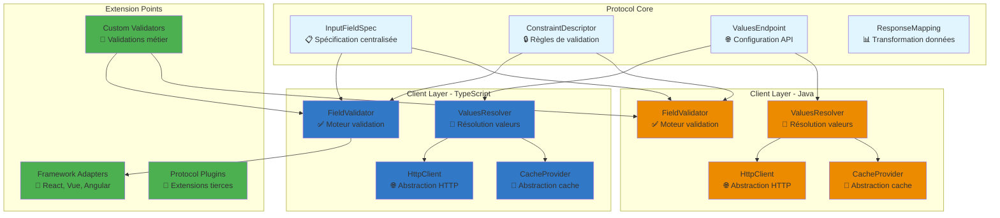
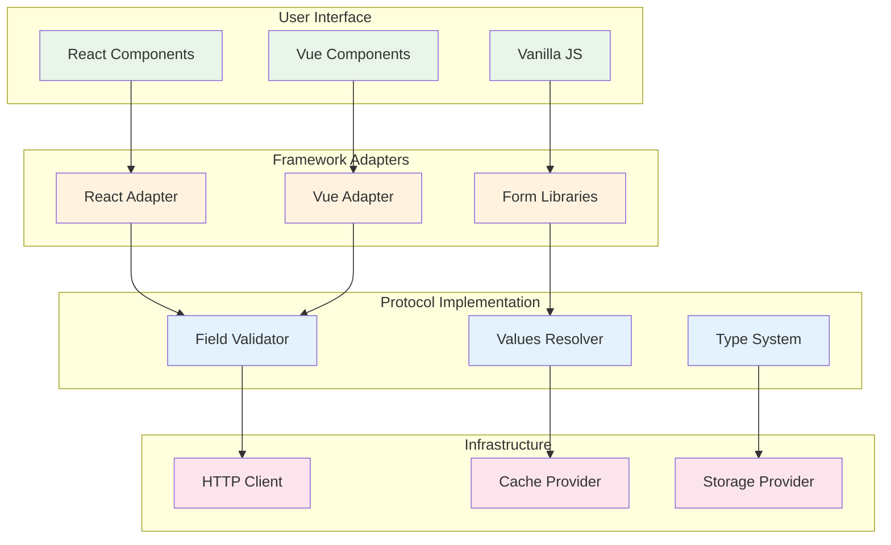

[🇫🇷 Français](./EXPERT_GUIDE.md) | [🇬🇧 English](./en/EXPERT_GUIDE.md)
# 🎓 Guide expert

*Architecture interne, optimisations avancées et contributions au protocole*

## 🎯 Objectifs de ce guide

Ce guide s'adresse aux développeurs expérimentés qui souhaitent :
- 🔬 **Comprendre l'architecture interne** du protocole et ses implémentations
- ⚡ **Optimiser les performances** pour des cas d'usage haute charge
- 🛠️ **Étendre le protocole** avec de nouvelles fonctionnalités
- 🤝 **Contribuer au développement** de l'écosystème
- 🔍 **Analyser les compromis techniques** et les choix d'implémentation

## 🏗️ Architecture interne du protocole

### Vue d'ensemble des composants



### Analyse des choix d'architecture

#### 1. **Séparation protocole/implémentation**

**✅ Forces :**
- Interopérabilité maximale entre langages
- Évolution indépendante des implémentations
- Tests de conformité standardisés

**⚠️ Compromis :**
- Complexité accrue pour des fonctionnalités spécifiques au langage
- Délai de synchronisation entre spécification et implémentations

```typescript
// Exemple : Extension spécifique TypeScript non portable
interface TypeScriptSpecificExtension {
  // Cette extension ne peut pas être portée en Java facilement
  dynamicValidation?: (value: any, context: Record<string, any>) => Promise<boolean>;
}
```

#### 2. **Architecture en couches**



**Avantages de cette approche :**
- **Testabilité** : Chaque couche peut être testée indépendamment
- **Flexibilité** : Possibilité de remplacer des couches spécifiques
- **Réutilisabilité** : Le cœur du protocole reste portable

## 🔬 Implémentation détaillée

### 1. Moteur de validation - Analyse approfondie

> ⚠️ Compatibilité rétro (v1) : Le moteur présenté ci‑dessous illustre encore certains points d'extension pour `enumValues` afin d'expliquer comment un adapter de migration peut fonctionner. En v2 canonique, les ensembles de valeurs doivent être fournis via `fieldSpec.valuesEndpoint` (INLINE ou distant). Lorsque vous construisez un moteur strictement v2, vous pouvez supprimer toute la logique faisant référence à `enumValues`.

```typescript
// TypeScript - Architecture interne du FieldValidator
export class FieldValidator {
  private static readonly DEFAULT_DATE_FORMAT = 'iso8601';
  private readonly constraintProcessors: Map<string, ConstraintProcessor>;
  
  constructor(
    private options: ValidatorOptions = {},
    private plugins: ValidatorPlugin[] = []
  ) {
    this.constraintProcessors = this.initializeProcessors();
    this.registerPlugins(plugins);
  }
  
  private initializeProcessors(): Map<string, ConstraintProcessor> {
    const processors = new Map<string, ConstraintProcessor>();
    
  // Processeurs de base du protocole (v2)
  processors.set('pattern', new PatternConstraintProcessor());
  processors.set('min', new MinConstraintProcessor());
  processors.set('max', new MaxConstraintProcessor());
  processors.set('format', new FormatConstraintProcessor());
  // NOTE v2: enumValues est retiré du modèle protocolaire canonique. Un processeur
  // peut subsister côté implémentation pour compatibilité rétro (adapter v1).
  // processors.set('enumValues', new LegacyEnumConstraintProcessor()); // Optionnel
    
    return processors;
  }
  
  // Méthode de validation avec stratégie de court-circuit optimisée
  async validate(
    fieldSpec: InputFieldSpec,
    value: any,
    constraintName?: string,
    context?: ValidationContext
  ): Promise<ValidationResult> {
    
    const validationContext = context || this.createDefaultContext();
    const errors: ValidationError[] = [];
    
    try {
      // 1. Validation de type précoce (fail fast)
      if (!this.isValidType(value, fieldSpec.dataType, fieldSpec.expectMultipleValues)) {
        return this.createTypeError(fieldSpec, value);
      }
      
      // 2. Validation required (court-circuit si échec)
      if (fieldSpec.required && this.isEmpty(value)) {
        return this.createRequiredError(fieldSpec);
      }
      
      // 3. Court-circuit si valeur vide et non requise
      if (this.isEmpty(value) && !fieldSpec.required) {
        return new ValidationResult(true, []);
      }
      
      // 4. Traitement des contraintes avec optimisations
      const constraints = constraintName 
        ? [this.findConstraint(fieldSpec.constraints, constraintName)]
        : fieldSpec.constraints;
      
      for (const constraint of constraints) {
        if (!constraint) continue;
        
        const constraintErrors = await this.processConstraint(
          constraint, 
          value, 
          fieldSpec, 
          validationContext
        );
        
        errors.push(...constraintErrors);
        
        // Court-circuit optionnel sur première erreur (performance)
        if (this.options.failFast && constraintErrors.length > 0) {
          break;
        }
      }
      
    } catch (error) {
      // Gestion robuste des erreurs de validation
      errors.push(new ValidationError(
        'validation_error',
        `Erreur interne de validation: ${error.message}`,
        value
      ));
    }
    
    return new ValidationResult(errors.length === 0, errors);
  }
  
  private async processConstraint(
    constraint: ConstraintDescriptor,
    value: any,
    fieldSpec: InputFieldSpec,
    context: ValidationContext
  ): Promise<ValidationError[]> {
    
    const errors: ValidationError[] = [];
    
    // Traitement des contraintes par ordre de priorité (optimisation)
    const processingOrder = this.getConstraintProcessingOrder(constraint);
    
    for (const constraintType of processingOrder) {
      const processor = this.constraintProcessors.get(constraintType);
      
      if (processor && processor.canProcess(constraint)) {
        try {
          const result = await processor.process(
            constraint, 
            value, 
            fieldSpec, 
            context
          );
          
          if (!result.isValid) {
            errors.push(...result.errors);
          }
          
        } catch (error) {
          errors.push(new ValidationError(
            constraintType,
            `Erreur de traitement ${constraintType}: ${error.message}`,
            value
          ));
        }
      }
    }
    
    return errors;
  }
  
  // Optimisation : ordre de traitement basé sur la complexité/coût
  private getConstraintProcessingOrder(constraint: ConstraintDescriptor): string[] {
    const order = [];
    
    // 1. Validations locales rapides d'abord
    if (constraint.pattern) order.push('pattern');
    if (constraint.min !== undefined) order.push('min');
    if (constraint.max !== undefined) order.push('max');
    if (constraint.format) order.push('format');
    
    // 2. Validations nécessitant des données externes en dernier
    // v2: les ensembles de valeurs sont définis via fieldSpec.valuesEndpoint (pas stocké dans la contrainte)
    // Un adapter de compatibilité pourrait encore pousser 'enumValues' ici.
    
    return order;
  }
}

// Interface pour les processeurs de contraintes extensibles
interface ConstraintProcessor {
  canProcess(constraint: ConstraintDescriptor): boolean;
  process(
    constraint: ConstraintDescriptor,
    value: any,
    fieldSpec: InputFieldSpec,
    context: ValidationContext
  ): Promise<ProcessingResult>;
}

// Exemple de processeur personnalisé
class CustomBusinessLogicProcessor implements ConstraintProcessor {
  canProcess(constraint: ConstraintDescriptor): boolean {
    return constraint.name.startsWith('business_');
  }
  
  async process(
    constraint: ConstraintDescriptor,
    value: any,
    fieldSpec: InputFieldSpec,
    context: ValidationContext
  ): Promise<ProcessingResult> {
    
    // Logique métier spécifique
    switch (constraint.name) {
      case 'business_unique_project_name':
        return this.validateProjectNameUniqueness(value, context);
      
      case 'business_user_permissions':
        return this.validateUserPermissions(value, context);
      
      default:
        return { isValid: true, errors: [] };
    }
  }
  
  private async validateProjectNameUniqueness(
    projectName: string, 
    context: ValidationContext
  ): Promise<ProcessingResult> {
    // Implémentation de la validation d'unicité
    const exists = await context.businessLogic.checkProjectNameExists(projectName);
    
    if (exists) {
      return {
        isValid: false,
        errors: [new ValidationError(
          'business_unique_project_name',
          'Ce nom de projet existe déjà',
          projectName
        )]
      };
    }
    
    return { isValid: true, errors: [] };
  }
}
```

### 2. Système de cache haute performance

```typescript
// Cache provider avec algorithmes avancés
export class HighPerformanceCacheProvider implements CacheProvider {
  private readonly primaryCache = new Map<string, CacheEntry>();
  private readonly indexCache = new Map<string, Set<string>>(); // Index pour invalidation en groupe
  private readonly writeQueue: CacheWrite[] = [];
  private readonly metrics: CacheMetrics;
  
  private readonly config: CacheConfig = {
    maxSize: 10000,
    defaultTTL: 5 * 60 * 1000, // 5 minutes
    maxMemoryUsage: 50 * 1024 * 1024, // 50MB
    evictionPolicy: 'LRU',
    writeStrategy: 'write-behind',
    compressionThreshold: 1024 // Compresser les objets > 1KB
  };
  
  constructor(config?: Partial<CacheConfig>) {
    this.config = { ...this.config, ...config };
    this.metrics = new CacheMetrics();
    this.setupWriteBehindProcessor();
    this.setupMemoryMonitoring();
  }
  
  get<T>(key: string): T | null {
    const start = performance.now();
    
    try {
      const entry = this.primaryCache.get(key);
      
      if (!entry) {
        this.metrics.recordMiss(key);
        return null;
      }
      
      if (this.isExpired(entry)) {
        this.primaryCache.delete(key);
        this.removeFromIndexes(key, entry);
        this.metrics.recordMiss(key);
        return null;
      }
      
      // Mise à jour LRU
      entry.lastAccessed = Date.now();
      entry.accessCount++;
      
      this.metrics.recordHit(key, performance.now() - start);
      
      // Décompression si nécessaire
      return this.deserializeValue<T>(entry.value);
      
    } catch (error) {
      this.metrics.recordError('get', error);
      return null;
    }
  }
  
  set<T>(key: string, value: T, ttlMs?: number): void {
    const serializedValue = this.serializeValue(value);
    const entry: CacheEntry = {
      value: serializedValue,
      createdAt: Date.now(),
      lastAccessed: Date.now(),
      accessCount: 1,
      expiresAt: ttlMs ? Date.now() + ttlMs : Date.now() + this.config.defaultTTL,
      size: this.calculateSize(serializedValue),
      compressed: serializedValue.length > this.config.compressionThreshold
    };
    
    if (this.config.writeStrategy === 'write-behind') {
      this.queueWrite(key, entry);
    } else {
      this.writeDirectly(key, entry);
    }
  }
  
  // Invalidation par pattern pour les données liées
  invalidatePattern(pattern: string): void {
    const regex = new RegExp(pattern);
    const keysToDelete: string[] = [];
    
    for (const [key] of this.primaryCache) {
      if (regex.test(key)) {
        keysToDelete.push(key);
      }
    }
    
    keysToDelete.forEach(key => this.delete(key));
    this.metrics.recordBatchInvalidation(keysToDelete.length);
  }
  
  // Invalidation par tag pour les groupes logiques
  invalidateByTag(tag: string): void {
    const keys = this.indexCache.get(tag);
    if (keys) {
      keys.forEach(key => this.delete(key));
      this.indexCache.delete(tag);
      this.metrics.recordTagInvalidation(tag, keys.size);
    }
  }
  
  private setupWriteBehindProcessor(): void {
    if (this.config.writeStrategy === 'write-behind') {
      setInterval(() => {
        this.processWriteQueue();
      }, 100); // Traiter la queue toutes les 100ms
    }
  }
  
  private processWriteQueue(): void {
    const batchSize = Math.min(this.writeQueue.length, 50);
    const batch = this.writeQueue.splice(0, batchSize);
    
    for (const write of batch) {
      try {
        this.writeDirectly(write.key, write.entry);
      } catch (error) {
        this.metrics.recordError('write_behind', error);
      }
    }
  }
  
  private writeDirectly(key: string, entry: CacheEntry): void {
    // Éviction si nécessaire
    if (this.shouldEvict()) {
      this.evictEntries();
    }
    
    // Enregistrement avec indexation
    this.primaryCache.set(key, entry);
    this.updateIndexes(key, entry);
    
    this.metrics.recordWrite(key, entry.size);
  }
  
  private shouldEvict(): boolean {
    return this.primaryCache.size >= this.config.maxSize ||
           this.getCurrentMemoryUsage() >= this.config.maxMemoryUsage;
  }
  
  private evictEntries(): void {
    const entriesToEvict = Math.max(1, Math.floor(this.config.maxSize * 0.1)); // Éviction de 10%
    
    switch (this.config.evictionPolicy) {
      case 'LRU':
        this.evictLRU(entriesToEvict);
        break;
      case 'LFU':
        this.evictLFU(entriesToEvict);
        break;
      case 'TTL':
        this.evictExpired();
        break;
    }
  }
  
  private evictLRU(count: number): void {
    const entries = Array.from(this.primaryCache.entries())
      .sort(([, a], [, b]) => a.lastAccessed - b.lastAccessed)
      .slice(0, count);
    
    entries.forEach(([key]) => {
      this.primaryCache.delete(key);
      this.removeFromIndexes(key, this.primaryCache.get(key)!);
    });
    
    this.metrics.recordEviction('LRU', count);
  }
  
  // Métriques détaillées pour le monitoring
  getDetailedMetrics(): DetailedCacheMetrics {
    return {
      ...this.metrics.getSummary(),
      memoryUsage: this.getCurrentMemoryUsage(),
      entryCount: this.primaryCache.size,
      averageEntrySize: this.getAverageEntrySize(),
      hotKeys: this.getHotKeys(10),
      evictionRate: this.metrics.getEvictionRate(),
      compressionRatio: this.getCompressionRatio()
    };
  }
  
  private getHotKeys(limit: number): Array<{ key: string; accessCount: number }> {
    return Array.from(this.primaryCache.entries())
      .map(([key, entry]) => ({ key, accessCount: entry.accessCount }))
      .sort((a, b) => b.accessCount - a.accessCount)
      .slice(0, limit);
  }
}
```

## ⚡ Optimisations avancées

### 1. Compilation et optimisation à l'exécution

```typescript
// Compilation dynamique des validations pour des performances maximales
export class CompiledValidator {
  private compiledValidators = new Map<string, CompiledValidationFunction>();
  
  compile(fieldSpec: InputFieldSpec): CompiledValidationFunction {
    const cacheKey = this.generateCacheKey(fieldSpec);
    
    if (this.compiledValidators.has(cacheKey)) {
      return this.compiledValidators.get(cacheKey)!;
    }
    
    const compiled = this.compileFieldSpec(fieldSpec);
    this.compiledValidators.set(cacheKey, compiled);
    
    return compiled;
  }
  
  private compileFieldSpec(fieldSpec: InputFieldSpec): CompiledValidationFunction {
    const validationSteps: ValidationStep[] = [];
    
    // Génération de code optimisé pour chaque contrainte
    for (const constraint of fieldSpec.constraints) {
      if (constraint.pattern) {
        const regex = new RegExp(constraint.pattern);
        validationSteps.push({
          type: 'pattern',
          validator: (value: string) => regex.test(value),
          errorMessage: constraint.errorMessage || 'Format invalide'
        });
      }
      
      if (constraint.min !== undefined || constraint.max !== undefined) {
        validationSteps.push(this.compileMinMaxValidation(constraint, fieldSpec));
      }
      
    // Legacy (migration): prise en charge optionnelle de enumValues pour specs non migrées
    if (constraint.enumValues) {
      const validValues = new Set(constraint.enumValues.map(ev => ev.value));
        validationSteps.push({
          type: 'enum',
          validator: (value: any) => validValues.has(value),
          errorMessage: constraint.errorMessage || 'Valeur non autorisée'
        });
      }
    }
    
    // Retourner une fonction optimisée
    return this.createOptimizedValidator(validationSteps, fieldSpec);
  }
  
  private createOptimizedValidator(
    steps: ValidationStep[], 
    fieldSpec: InputFieldSpec
  ): CompiledValidationFunction {
    
    return (value: any): ValidationResult => {
      // Validation rapide du type
      if (!this.fastTypeCheck(value, fieldSpec.dataType, fieldSpec.expectMultipleValues)) {
        return {
          isValid: false,
          errors: [{ 
            constraintName: 'type', 
            message: `Type ${fieldSpec.dataType} attendu` 
          }]
        };
      }
      
      // Validation required
      if (fieldSpec.required && (value === null || value === undefined || value === '')) {
        return {
          isValid: false,
          errors: [{ 
            constraintName: 'required', 
            message: 'Ce champ est obligatoire' 
          }]
        };
      }
      
      // Exécution des étapes compilées
      const errors: ValidationError[] = [];
      
      if (fieldSpec.expectMultipleValues && Array.isArray(value)) {
        // Validation optimisée pour les tableaux
        for (let i = 0; i < value.length; i++) {
          for (const step of steps) {
            if (!step.validator(value[i])) {
              errors.push({
                constraintName: `${step.type}[${i}]`,
                message: step.errorMessage
              });
            }
          }
        }
      } else {
        // Validation pour valeur unique
        for (const step of steps) {
          if (!step.validator(value)) {
            errors.push({
              constraintName: step.type,
              message: step.errorMessage
            });
          }
        }
      }
      
      return {
        isValid: errors.length === 0,
        errors
      };
    };
  }
  
  private fastTypeCheck(value: any, dataType: DataType, expectMultiple: boolean): boolean {
    if (expectMultiple) {
      return Array.isArray(value) && value.every(v => this.checkSingleType(v, dataType));
    }
    return this.checkSingleType(value, dataType);
  }
  
  private checkSingleType(value: any, dataType: DataType): boolean {
    switch (dataType) {
      case DataType.STRING: return typeof value === 'string';
      case DataType.NUMBER: return typeof value === 'number' && !isNaN(value);
      case DataType.BOOLEAN: return typeof value === 'boolean';
      case DataType.DATE: return !isNaN(Date.parse(value));
      default: return false;
    }
  }
}

type CompiledValidationFunction = (value: any) => ValidationResult;

interface ValidationStep {
  type: string;
  validator: (value: any) => boolean;
  errorMessage: string;
}
```

### 2. Pool de workers pour validations asynchrones

```typescript
// Worker pool pour validation parallèle haute performance
export class ValidationWorkerPool {
  private workers: Worker[] = [];
  private taskQueue: ValidationTask[] = [];
  private activeWorkers = new Set<number>();
  private workerResults = new Map<string, Promise<ValidationResult>>();
  
  constructor(private poolSize: number = navigator.hardwareConcurrency || 4) {
    this.initializeWorkers();
  }
  
  private initializeWorkers(): void {
    for (let i = 0; i < this.poolSize; i++) {
      const worker = new Worker(new URL('./validation-worker.ts', import.meta.url));
      
      worker.onmessage = (event) => {
        this.handleWorkerMessage(i, event.data);
      };
      
      worker.onerror = (error) => {
        console.error(`Erreur worker ${i}:`, error);
        this.handleWorkerError(i, error);
      };
      
      this.workers[i] = worker;
    }
  }
  
  async validateAsync(
    fieldSpec: InputFieldSpec, 
    value: any, 
    priority: 'low' | 'normal' | 'high' = 'normal'
  ): Promise<ValidationResult> {
    
    const taskId = this.generateTaskId();
    const task: ValidationTask = {
      id: taskId,
      fieldSpec: JSON.parse(JSON.stringify(fieldSpec)), // Clone pour sérialisation
      value,
      priority,
      timestamp: Date.now()
    };
    
    // Créer la promesse de résultat
    const resultPromise = new Promise<ValidationResult>((resolve, reject) => {
      task.resolve = resolve;
      task.reject = reject;
    });
    
    this.workerResults.set(taskId, resultPromise);
    
    // Ajouter à la queue avec priorité
    this.addToQueue(task);
    this.processQueue();
    
    return resultPromise;
  }
  
  private addToQueue(task: ValidationTask): void {
    // Insertion avec tri par priorité
    const priorityOrder = { high: 0, normal: 1, low: 2 };
    
    let insertIndex = this.taskQueue.length;
    for (let i = 0; i < this.taskQueue.length; i++) {
      if (priorityOrder[task.priority] < priorityOrder[this.taskQueue[i].priority]) {
        insertIndex = i;
        break;
      }
    }
    
    this.taskQueue.splice(insertIndex, 0, task);
  }
  
  private processQueue(): void {
    // Assigner les tâches aux workers disponibles
    for (let workerId = 0; workerId < this.workers.length; workerId++) {
      if (!this.activeWorkers.has(workerId) && this.taskQueue.length > 0) {
        const task = this.taskQueue.shift()!;
        this.assignTaskToWorker(workerId, task);
      }
    }
  }
  
  private assignTaskToWorker(workerId: number, task: ValidationTask): void {
    this.activeWorkers.add(workerId);
    
    const worker = this.workers[workerId];
    worker.postMessage({
      type: 'VALIDATE',
      taskId: task.id,
      fieldSpec: task.fieldSpec,
      value: task.value
    });
    
    // Timeout de sécurité
    setTimeout(() => {
      if (this.activeWorkers.has(workerId)) {
        this.handleWorkerTimeout(workerId, task);
      }
    }, 30000); // 30 secondes timeout
  }
  
  private handleWorkerMessage(workerId: number, message: any): void {
    this.activeWorkers.delete(workerId);
    
    if (message.type === 'VALIDATION_RESULT') {
      const resultPromise = this.workerResults.get(message.taskId);
      if (resultPromise) {
        const task = this.findTaskById(message.taskId);
        if (task?.resolve) {
          task.resolve(message.result);
        }
        this.workerResults.delete(message.taskId);
      }
    }
    
    // Traiter la prochaine tâche en queue
    this.processQueue();
  }
  
  // Métriques de performance du pool
  getPoolMetrics(): WorkerPoolMetrics {
    return {
      totalWorkers: this.workers.length,
      activeWorkers: this.activeWorkers.size,
      queueLength: this.taskQueue.length,
      avgTaskCompletionTime: this.calculateAvgCompletionTime(),
      throughput: this.calculateThroughput()
    };
  }
  
  // Optimisation dynamique de la taille du pool
  optimizePoolSize(): void {
    const metrics = this.getPoolMetrics();
    
    if (metrics.queueLength > metrics.totalWorkers * 2 && metrics.totalWorkers < 16) {
      // Augmenter la taille du pool si queue trop longue
      this.addWorker();
    } else if (metrics.avgTaskCompletionTime < 10 && metrics.totalWorkers > 2) {
      // Réduire si les tâches sont trop rapides (overhead de sérialisation)
      this.removeWorker();
    }
  }
}

// Worker de validation (fichier séparé: validation-worker.ts)
self.onmessage = async (event) => {
  const { type, taskId, fieldSpec, value } = event.data;
  
  if (type === 'VALIDATE') {
    try {
      // Import dynamique pour éviter le bundling
      const { FieldValidator } = await import('./field-validator');
      
      const validator = new FieldValidator();
      const result = await validator.validate(fieldSpec, value);
      
      self.postMessage({
        type: 'VALIDATION_RESULT',
        taskId,
        result
      });
      
    } catch (error) {
      self.postMessage({
        type: 'VALIDATION_ERROR',
        taskId,
        error: error.message
      });
    }
  }
};
```

## 🔧 Extension du protocole

### 1. Système de plugins

```typescript
// Architecture de plugins pour étendre le protocole
export interface ProtocolPlugin {
  name: string;
  version: string;
  
  // Hooks du cycle de vie
  onFieldSpecLoad?(fieldSpec: InputFieldSpec): InputFieldSpec;
  onValidationStart?(fieldSpec: InputFieldSpec, value: any): void;
  onValidationComplete?(result: ValidationResult): ValidationResult;
  onValuesResolve?(endpoint: ValuesEndpoint, options: FetchValuesOptions): FetchValuesOptions;
  
  // Extensions de contraintes
  customConstraints?: Map<string, ConstraintProcessor>;
  
  // Extensions de types
  customDataTypes?: Map<string, DataTypeProcessor>;
  
  // Méta-informations
  dependencies?: string[];
  conflicts?: string[];
}

export class ProtocolExtensionManager {
  private plugins = new Map<string, ProtocolPlugin>();
  private hooks = new Map<string, ProtocolPlugin[]>();
  
  registerPlugin(plugin: ProtocolPlugin): void {
    // Vérifier les dépendances
    this.validatePluginDependencies(plugin);
    
    // Vérifier les conflits
    this.checkPluginConflicts(plugin);
    
    // Enregistrer le plugin
    this.plugins.set(plugin.name, plugin);
    
    // Enregistrer les hooks
    this.registerPluginHooks(plugin);
    
    console.log(`Plugin ${plugin.name} v${plugin.version} enregistré`);
  }
  
  private validatePluginDependencies(plugin: ProtocolPlugin): void {
    if (plugin.dependencies) {
      for (const dependency of plugin.dependencies) {
        if (!this.plugins.has(dependency)) {
          throw new Error(
            `Plugin ${plugin.name} nécessite la dépendance: ${dependency}`
          );
        }
      }
    }
  }
  
  async executeHook<T>(
    hookName: string, 
    context: T, 
    ...args: any[]
  ): Promise<T> {
    const plugins = this.hooks.get(hookName) || [];
    let result = context;
    
    for (const plugin of plugins) {
      try {
        const hookMethod = (plugin as any)[hookName];
        if (typeof hookMethod === 'function') {
          result = await hookMethod.call(plugin, result, ...args) || result;
        }
      } catch (error) {
        console.error(`Erreur dans le plugin ${plugin.name}, hook ${hookName}:`, error);
        // Continuer avec les autres plugins
      }
    }
    
    return result;
  }
  
  getExtendedConstraintProcessors(): Map<string, ConstraintProcessor> {
    const processors = new Map<string, ConstraintProcessor>();
    
    for (const plugin of this.plugins.values()) {
      if (plugin.customConstraints) {
        for (const [name, processor] of plugin.customConstraints) {
          processors.set(name, processor);
        }
      }
    }
    
    return processors;
  }
}

// Exemple de plugin pour l'internationalisation
export class I18nPlugin implements ProtocolPlugin {
  name = 'i18n';
  version = '1.0.0';
  
  constructor(private locale: string, private translations: Record<string, any>) {}
  
  onFieldSpecLoad(fieldSpec: InputFieldSpec): InputFieldSpec {
    // Traduire les textes de l'interface
    const translated = { ...fieldSpec };
    
    if (this.translations[this.locale]) {
      const localeTranslations = this.translations[this.locale];
      
      if (localeTranslations.fields?.[fieldSpec.displayName]) {
        const fieldTranslations = localeTranslations.fields[fieldSpec.displayName];
        
        translated.displayName = fieldTranslations.displayName || fieldSpec.displayName;
        translated.description = fieldTranslations.description || fieldSpec.description;
        
        // Traduire les messages d'erreur des contraintes
        translated.constraints = fieldSpec.constraints.map(constraint => ({
          ...constraint,
          errorMessage: fieldTranslations.constraints?.[constraint.name]?.errorMessage 
            || constraint.errorMessage
        }));
      }
    }
    
    return translated;
  }
  
  onValidationComplete(result: ValidationResult): ValidationResult {
    // Traduire les messages d'erreur
    const translatedErrors = result.errors.map(error => ({
      ...error,
      message: this.translateErrorMessage(error.message, error.constraintName)
    }));
    
    return {
      ...result,
      errors: translatedErrors
    };
  }
  
  private translateErrorMessage(message: string, constraintName: string): string {
    const translations = this.translations[this.locale]?.errors;
    return translations?.[constraintName] || translations?.generic || message;
  }
}

// Plugin pour validation métier personnalisée
export class BusinessLogicPlugin implements ProtocolPlugin {
  name = 'business-logic';
  version = '1.0.0';
  
  customConstraints = new Map<string, ConstraintProcessor>([
    ['unique_identifier', new UniqueIdentifierProcessor()],
    ['business_rules', new BusinessRulesProcessor()],
    ['conditional_validation', new ConditionalValidationProcessor()]
  ]);
  
  constructor(private businessService: BusinessLogicService) {}
  
  onValidationStart(fieldSpec: InputFieldSpec, value: any): void {
    // Logger les validations pour audit
    this.businessService.logValidationAttempt(fieldSpec.displayName, value);
  }
}
```

### 2. Analyse de performance et profiling

```typescript
// Profiler avancé pour analyser les performances
export class ValidationProfiler {
  private profiles = new Map<string, PerformanceProfile>();
  private activeProfiles = new Map<string, PerformanceSession>();
  
  startProfiling(sessionId: string): void {
    this.activeProfiles.set(sessionId, {
      startTime: performance.now(),
      operations: [],
      memoryStart: this.getMemoryUsage()
    });
  }
  
  recordOperation(
    sessionId: string, 
    operation: string, 
    duration: number, 
    metadata?: any
  ): void {
    const session = this.activeProfiles.get(sessionId);
    if (session) {
      session.operations.push({
        operation,
        duration,
        timestamp: performance.now() - session.startTime,
        metadata
      });
    }
  }
  
  endProfiling(sessionId: string): PerformanceReport {
    const session = this.activeProfiles.get(sessionId);
    if (!session) {
      throw new Error(`Session de profiling non trouvée: ${sessionId}`);
    }
    
    const totalDuration = performance.now() - session.startTime;
    const memoryEnd = this.getMemoryUsage();
    
    const report: PerformanceReport = {
      sessionId,
      totalDuration,
      memoryDelta: memoryEnd - session.memoryStart,
      operationCount: session.operations.length,
      operations: session.operations,
      bottlenecks: this.identifyBottlenecks(session.operations),
      recommendations: this.generateRecommendations(session.operations)
    };
    
    this.activeProfiles.delete(sessionId);
    this.profiles.set(sessionId, {
      report,
      timestamp: Date.now()
    });
    
    return report;
  }
  
  private identifyBottlenecks(operations: PerformanceOperation[]): Bottleneck[] {
    const bottlenecks: Bottleneck[] = [];
    
    // Identifier les opérations les plus lentes
    const sortedOps = [...operations].sort((a, b) => b.duration - a.duration);
    const slowOps = sortedOps.slice(0, 3).filter(op => op.duration > 10);
    
    for (const op of slowOps) {
      bottlenecks.push({
        type: 'slow_operation',
        operation: op.operation,
        impact: 'high',
        description: `Opération ${op.operation} prend ${op.duration.toFixed(2)}ms`,
        suggestion: this.getSuggestionForOperation(op.operation)
      });
    }
    
    // Identifier les opérations répétitives
    const operationCounts = new Map<string, number>();
    operations.forEach(op => {
      operationCounts.set(op.operation, (operationCounts.get(op.operation) || 0) + 1);
    });
    
    for (const [operation, count] of operationCounts) {
      if (count > 10) {
        bottlenecks.push({
          type: 'repeated_operation',
          operation,
          impact: 'medium',
          description: `Opération ${operation} répétée ${count} fois`,
          suggestion: 'Considérer la mise en cache ou le batching'
        });
      }
    }
    
    return bottlenecks;
  }
  
  generateOptimizationReport(): OptimizationReport {
    const allProfiles = Array.from(this.profiles.values());
    
    return {
      totalSessions: allProfiles.length,
      averageSessionDuration: this.calculateAverageSessionDuration(allProfiles),
      commonBottlenecks: this.findCommonBottlenecks(allProfiles),
      performanceTrends: this.analyzePerformanceTrends(allProfiles),
      recommendations: this.generateGlobalRecommendations(allProfiles)
    };
  }
  
  private calculateAverageSessionDuration(profiles: PerformanceProfile[]): number {
    if (profiles.length === 0) return 0;
    
    const totalDuration = profiles.reduce(
      (sum, profile) => sum + profile.report.totalDuration, 
      0
    );
    
    return totalDuration / profiles.length;
  }
  
  private findCommonBottlenecks(profiles: PerformanceProfile[]): CommonBottleneck[] {
    const bottleneckFrequency = new Map<string, number>();
    
    profiles.forEach(profile => {
      profile.report.bottlenecks.forEach(bottleneck => {
        const key = `${bottleneck.type}:${bottleneck.operation}`;
        bottleneckFrequency.set(key, (bottleneckFrequency.get(key) || 0) + 1);
      });
    });
    
    return Array.from(bottleneckFrequency.entries())
      .filter(([, frequency]) => frequency >= 3)
      .map(([key, frequency]) => {
        const [type, operation] = key.split(':');
        return {
          type,
          operation,
          frequency,
          impactLevel: frequency > 10 ? 'critical' : frequency > 5 ? 'high' : 'medium'
        };
      })
      .sort((a, b) => b.frequency - a.frequency);
  }
}

interface PerformanceReport {
  sessionId: string;
  totalDuration: number;
  memoryDelta: number;
  operationCount: number;
  operations: PerformanceOperation[];
  bottlenecks: Bottleneck[];
  recommendations: string[];
}

interface Bottleneck {
  type: 'slow_operation' | 'repeated_operation' | 'memory_leak';
  operation: string;
  impact: 'low' | 'medium' | 'high' | 'critical';
  description: string;
  suggestion: string;
}
```

## 🤝 Contributions au protocole

### Guide pour contribuer

#### 1. **Architecture des contributions**

```mermaid
graph TB
    subgraph "Types de contributions"
        SPEC[📋 Spécification protocole]
        IMPL[💻 Implémentations]
        DOCS[📖 Documentation]
        TESTS[🧪 Tests de conformité]
    end
    
    subgraph "Processus de validation"
        RFC[📝 RFC (Request for Comments)]
        REVIEW[👥 Revue par les pairs]
        PROTO[🏗️ Prototype]
        COMPAT[🔄 Tests compatibilité]
    end
    
    subgraph "Intégration"
        MERGE[🔀 Intégration]
        RELEASE[🚀 Release]
        MIGRATION[📦 Guide migration]
    end
    
    SPEC --> RFC
    IMPL --> REVIEW
    DOCS --> REVIEW
    TESTS --> COMPAT
    
    RFC --> PROTO
    REVIEW --> PROTO
    PROTO --> COMPAT
    COMPAT --> MERGE
    
    MERGE --> RELEASE
    RELEASE --> MIGRATION
    
    classDef contribution fill:#e8f5e8
    classDef validation fill:#fff3e0
    classDef integration fill:#e3f2fd
    
    class SPEC,IMPL,DOCS,TESTS contribution
    class RFC,REVIEW,PROTO,COMPAT validation
    class MERGE,RELEASE,MIGRATION integration
```

#### 2. **Standards de contribution**

```typescript
// Template pour une nouvelle contrainte
export interface NewConstraintProposal {
  // Métadonnées obligatoires
  name: string;
  version: string;
  author: string;
  description: string;
  
  // Spécification technique
  constraintSpec: {
    supportedDataTypes: DataType[];
    parameters: ConstraintParameter[];
    behavior: ConstraintBehavior;
  };
  
  // Tests de conformité obligatoires
  conformanceTests: ConformanceTest[];
  
  // Documentation
  documentation: {
    examples: ConstraintExample[];
    useCases: string[];
    migration?: MigrationGuide;
  };
  
  // Compatibilité
  compatibility: {
    minProtocolVersion: string;
    backwardCompatible: boolean;
    breakingChanges?: string[];
  };
}

// Tests de conformité standardisés
export interface ConformanceTest {
  name: string;
  description: string;
  fieldSpec: InputFieldSpec;
  testCases: Array<{
    input: any;
    expectedResult: {
      isValid: boolean;
      errors?: string[];
    };
    description: string;
  }>;
}

// Exemple de contribution: constraint "credit_card"
export const CreditCardConstraintProposal: NewConstraintProposal = {
  name: "credit_card_validation",
  version: "1.0.0",
  author: "community",
  description: "Validation de numéros de carte de crédit avec algorithme de Luhn",
  
  constraintSpec: {
    supportedDataTypes: [DataType.STRING],
    parameters: [
      {
        name: "acceptedTypes",
        type: "string[]",
        description: "Types de cartes acceptées (visa, mastercard, amex, etc.)",
        optional: true
      }
    ],
    behavior: {
      validatesFormat: true,
      validatesChecksum: true,
      cacheable: true
    }
  },
  
  conformanceTests: [
    {
      name: "visa_card_validation",
      description: "Validation d'un numéro Visa valide",
      fieldSpec: {
        displayName: "Numéro de carte",
        dataType: DataType.STRING,
        expectMultipleValues: false,
        required: true,
        constraints: [
          {
            name: "cardValidation",
            type: "credit_card_validation",
            params: { acceptedTypes: ["visa"] }
          }
        ]
      },
      testCases: [
        {
          input: "4111111111111111",
          expectedResult: { isValid: true },
          description: "Numéro Visa valide"
        },
        {
          input: "5555555555554444",
          expectedResult: { 
            isValid: false, 
            errors: ["Type de carte non accepté"] 
          },
          description: "Numéro Mastercard avec restriction Visa"
        }
      ]
    }
  ],
  
  documentation: {
    examples: [
      {
        title: "Validation carte de crédit basique",
        fieldSpec: "/* voir conformanceTests */",
        description: "Exemple d'usage standard"
      }
    ],
    useCases: [
      "Formulaires de paiement e-commerce",
      "Validation de moyens de paiement",
      "Systèmes de facturation"
    ]
  },
  
  compatibility: {
    minProtocolVersion: "1.0.0",
    backwardCompatible: true
  }
};
```

#### 3. **Implémentation de référence**

```typescript
// Implémentation de référence pour les nouveaux contributeurs
export class ReferenceConstraintProcessor implements ConstraintProcessor {
  canProcess(constraint: ConstraintDescriptor): boolean {
    return constraint.name === 'credit_card_validation';
  }
  
  async process(
    constraint: ConstraintDescriptor,
    value: any,
    fieldSpec: InputFieldSpec,
    context: ValidationContext
  ): Promise<ProcessingResult> {
    
    if (typeof value !== 'string') {
      return {
        isValid: false,
        errors: [new ValidationError(
          constraint.name,
          'Numéro de carte doit être une chaîne de caractères',
          value
        )]
      };
    }
    
    // Nettoyer le numéro (retirer espaces et tirets)
    const cleanNumber = value.replace(/[\s-]/g, '');
    
    // Vérifier le format de base
    if (!/^\d{13,19}$/.test(cleanNumber)) {
      return {
        isValid: false,
        errors: [new ValidationError(
          constraint.name,
          constraint.errorMessage || 'Format de numéro de carte invalide',
          value
        )]
      };
    }
    
    // Algorithme de Luhn
    if (!this.validateLuhn(cleanNumber)) {
      return {
        isValid: false,
        errors: [new ValidationError(
          constraint.name,
          constraint.errorMessage || 'Numéro de carte invalide',
          value
        )]
      };
    }
    
    // Vérifier les types acceptés si spécifiés
    const acceptedTypes = constraint.acceptedTypes;
    if (acceptedTypes && acceptedTypes.length > 0) {
      const cardType = this.detectCardType(cleanNumber);
      if (!acceptedTypes.includes(cardType)) {
        return {
          isValid: false,
          errors: [new ValidationError(
            constraint.name,
            `Type de carte ${cardType} non accepté`,
            value
          )]
        };
      }
    }
    
    return { isValid: true, errors: [] };
  }
  
  private validateLuhn(number: string): boolean {
    let sum = 0;
    let isEven = false;
    
    for (let i = number.length - 1; i >= 0; i--) {
      let digit = parseInt(number[i]);
      
      if (isEven) {
        digit *= 2;
        if (digit > 9) {
          digit -= 9;
        }
      }
      
      sum += digit;
      isEven = !isEven;
    }
    
    return sum % 10 === 0;
  }
  
  private detectCardType(number: string): string {
    // Patterns de détection simplifiés
    if (/^4/.test(number)) return 'visa';
    if (/^5[1-5]/.test(number)) return 'mastercard';
    if (/^3[47]/.test(number)) return 'amex';
    if (/^6/.test(number)) return 'discover';
    
    return 'unknown';
  }
}
```

### Roadmap technique

#### Version 2.0 (Planifiée)

```typescript
// Nouvelles fonctionnalités prévues
interface ProtocolV2Extensions {
  // Validation conditionnelle avancée
  conditionalConstraints: {
    condition: string; // Expression logique
    constraints: ConstraintDescriptor[];
  }[];
  
  // Internationalisation native
  i18n: {
    defaultLocale: string;
    translations: Record<string, TranslationSet>;
  };
  
  // Validation côté serveur intégrée
  serverValidation: {
    endpoint: string;
    batchSupport: boolean;
    realTimeValidation: boolean;
  };
  
  // Métriques et analytics intégrés
  analytics: {
    trackPerformance: boolean;
    trackUserBehavior: boolean;
    metricsEndpoint?: string;
  };
}
```

## 📊 Analyse critique et limites

### Forces du protocole actuel

1. **✅ Simplicité conceptuelle** - API claire et compréhensible
2. **✅ Interopérabilité** - Standard cross-language efficace
3. **✅ Extensibilité** - Architecture plugin bien pensée
4. **✅ Performance** - Optimisations disponibles pour tous les cas d'usage

### Limites identifiées

1. **⚠️ Validation conditionnelle complexe** - Limitée aux cas simples
2. **⚠️ Gestion d'état** - Pas de solution native pour les formulaires multi-étapes
3. **⚠️ Synchronisation** - Pas de mécanisme de mise à jour temps réel des spécifications
4. **⚠️ Offline** - Support limité pour les applications déconnectées

### Recommandations d'amélioration

```typescript
// Proposition d'amélioration: ValidationContext enrichi
interface EnhancedValidationContext {
  // Contexte actuel
  formData: Record<string, any>;
  userContext: UserContext;
  businessLogic: BusinessLogicService;
  
  // Nouvelles capacités proposées
  formState: FormState; // Multi-step, wizard, etc.
  dependencies: FieldDependencyGraph;
  realTimeSync: RealtimeSyncManager;
  offlineSupport: OfflineValidationCache;
}
```

## 🎯 Conclusion

Ce guide expert a couvert :

- 🔬 **Architecture interne** détaillée avec les compromis techniques
- ⚡ **Optimisations avancées** pour les cas d'usage haute performance  
- 🔧 **Extension du protocole** via le système de plugins
- 🤝 **Contribution au projet** avec standards et processus
- 📊 **Analyse critique** des forces et limitations actuelles

### Pour aller plus loin

1. 🔍 [Code source TypeScript](../impl/typescript/src/) - Implémentation de référence
2. ☕ [Code source Java](../impl/java/src/) - Implémentation enterprise
3. 🧪 [Tests de conformité](../tests/) - Suite de tests standardisés
4. 💬 [Discussions techniques](../../discussions) - Échanges avec la communauté

---

*Temps estimé : 2-4 heures • Difficulté : Expert*