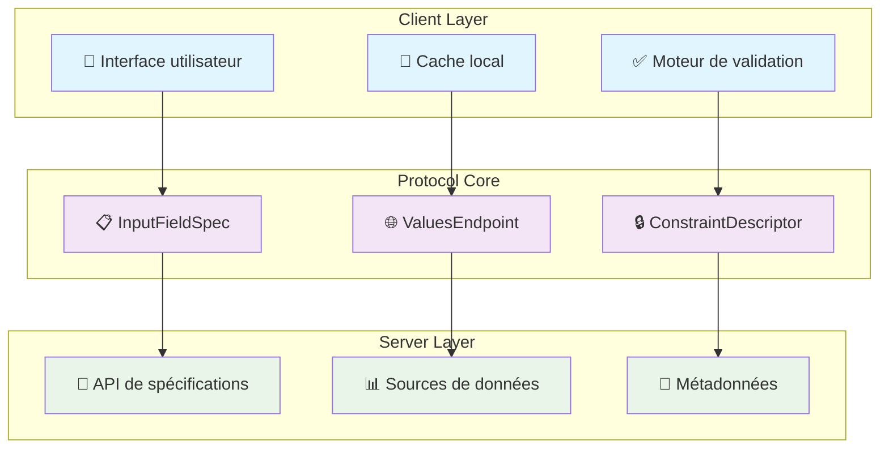
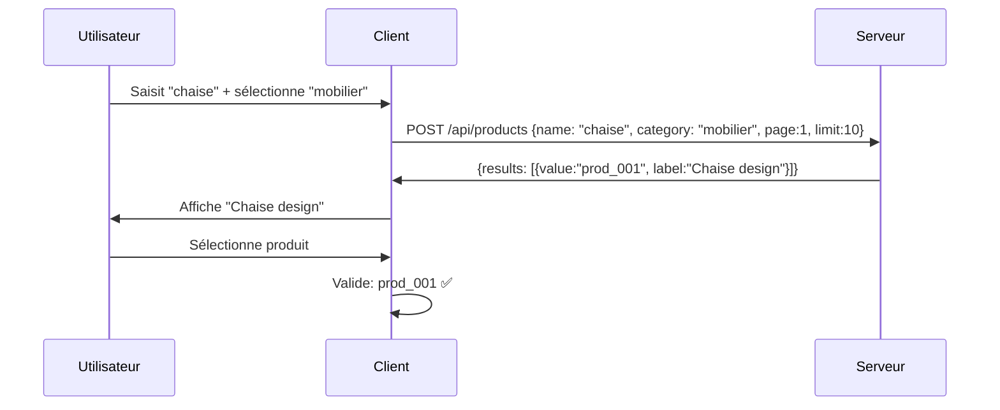
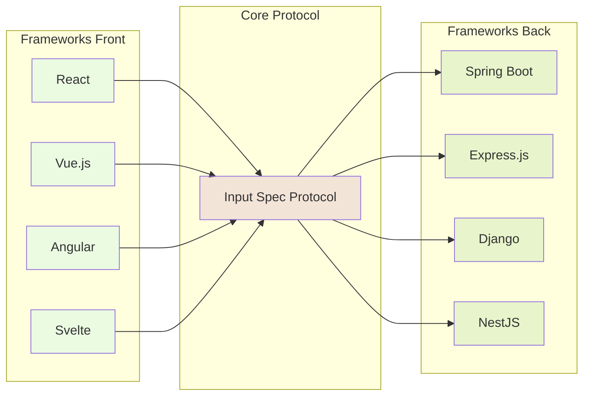

[🇫🇷 Français](./OVERVIEW.md) | [🇬🇧 English](./en/OVERVIEW.md)

# Dynamic Input Field Specification Protocol v2.1

*Le standard moderne pour des champs de formulaire intelligents, adaptatifs et interopérables*


## 🚩 Pourquoi ce protocole est unique ?

Le **Dynamic Input Field Specification Protocol v2.1** résout enfin la fragmentation des formulaires dynamiques :

- 🔥 **Standardisation totale** : une seule structure pour décrire contraintes, valeurs, validation et comportement
- 🧩 **Interopérabilité** : front et back parlent le même langage, sans duplication
- 🛠️ **Recherche avancée** : support natif des recherches multi-critères, pagination, cache, debouncing
- 🧑‍💻 **Extensible et agnostique** : pas lié à un framework, ni à une techno
- 🏗️ **Atomicité des contraintes** : chaque règle est indépendante, claire et télémetrée


## 🔍 Qu'est-ce que ce protocole ?

Une **spécification universelle** pour décrire dynamiquement chaque champ de formulaire :

- Métadonnées complètes (label, type, aide, etc.)
- Contraintes atomiques (regex, min/max, custom, etc.)
- Source de valeurs (statique ou distante, paginée, filtrée)
- Validation pipeline ordonné et déterministe
- Recherche avancée via `searchParams` et `searchParamsSchema` (JSON Schema)

### Architecture générale



## 🚫 Ce que nous ne sommes PAS

- ❌ Un framework de formulaires (React, Angular, Vue…)
- ❌ Un validateur de données (Joi, Yup, Zod…)
- ❌ Un SDK ou une librairie imposée

> **Nous sommes** un **protocole universel** : il décrit, il ne code pas. Il permet à vos outils, frameworks et langages de collaborer sans friction ni duplication.

## ✅ Notre valeur ajoutée concrète

### Pour les développeurs front-end
- **Fini le copier-coller** de logique de validation entre projets
- **Formulaires auto-adaptatifs** basés sur les métadonnées serveur
- **Validation temps réel** avec debouncing et cache automatiques
- **Composants génériques** réutilisables entre projets

### Pour les développeurs back-end  
- **Source unique de vérité** pour les contraintes de validation
- **API uniforme** pour exposer les métadonnées de champs
- **Évolutivité** sans casser les clients existants
- **Intégration simple** avec vos endpoints existants

### Pour les équipes
- **Réduction drastique** de la maintenance de code dupliqué
- **Cohérence** automatique entre front et back
- **Onboarding facilité** avec des patterns standards
- **Time-to-market réduit** pour les nouveaux formulaires


## 🎪 Démonstration avancée (v2.1)

**Exemple : Recherche multi-critères sur un champ produit**

**🖥️ Côté serveur** - Spécification du champ :
```json
{
    "displayName": "Produit",
    "dataType": "STRING",
    "expectMultipleValues": false,
    "required": true,
    "valuesEndpoint": {
        "protocol": "HTTPS",
        "uri": "/api/products",
        "method": "POST",
        "searchParams": { "name": "chaise", "category": "mobilier" },
        "searchParamsSchema": {
            "type": "object",
            "properties": {
                "name": { "type": "string", "description": "Nom du produit (recherche partielle)" },
                "category": { "type": "string", "description": "Catégorie du produit" }
            },
            "required": ["name"]
        },
        "paginationStrategy": "PAGE_NUMBER",
        "responseMapping": { "dataField": "results" }
    },
    "constraints": []
}
```

**💻 Côté client** - Adaptation automatique :
```typescript
const ProductField = ({ fieldSpec }) => (
    <SmartSelectField spec={fieldSpec} /> // Recherche multi-critères, pagination, validation pipeline
)
```

**🔄 Flux d'interaction** :


## 🚀 Pour qui est-ce fait ?

### ✅ Vous devriez considérer ce protocole si :
- Vous développez des applications avec **beaucoup de formulaires**
- Vous voulez **réduire la duplication** entre front et back
- Vous cherchez à **standardiser** vos patterns de validation
- Vous construisez des **systèmes multi-clients** (web, mobile, API)
- Vous voulez des **formulaires adaptatifs** et configurables

### ❌ Ce protocole n'est probablement pas pour vous si :
- Votre application a **moins de 5 formulaires** au total
- Vous préférez **tout contrôler manuellement** côté front
- Vos formulaires sont **ultra-spécifiques** sans patterns communs
- Vous n'avez **pas le contrôle du back-end**

## 📚 Commencer maintenant

### Pour les pressés (5 minutes)
👉 [Guide de démarrage rapide](./QUICK_START.md)

### Pour l'intégration (30 minutes)  
👉 [Guide intermédiaire](./INTERMEDIATE_GUIDE.md)

### Pour maîtriser le protocole (2 heures)
👉 [Guide expert](./EXPERT_GUIDE.md)

## 🏗️ Implémentations disponibles

| Langage | Status | Validation | Recherche avancée | Client HTTP | Cache | Tests |
|---------|--------|------------|-------------------|-------------|--------|--------|
| **TypeScript** | ✅ Stable | ✅ Complète | ✅ searchParams | ✅ Fetch/Axios | ✅ Mémoire | ✅ Jest |
| **Java** | ✅ Stable | ✅ Complète | ✅ searchParams | 🚧 En cours | 🚧 En cours | ✅ JUnit |
| **Python** | 📋 Planifié | - | - | - | - | - |
| **C#** | 📋 Planifié | - | - | - | - | - |

## 🔧 Écosystème et intégrations




## 🗺️ Feuille de route

### ✅ Version 2.1 (Actuelle)
- ✅ Recherche avancée multi-critères (`searchParams`, `searchParamsSchema`)
- ✅ Atomicité des contraintes
- ✅ Documentation exhaustive et guides
- ✅ Implémentations TypeScript & Java

### 🚧 Version 2.2 (En cours)
- 🚧 Client HTTP Java complet
- 🚧 Système de cache Java
- 🚧 Adaptateurs React/Vue/Svelte
- 🚧 Métriques de performance

### 📋 Versions futures
- 📋 Support des validations conditionnelles
- 📋 Internationalisation native
- 📋 Validation côté serveur intégrée
- 📋 SDK Python et C#

## 🤝 Contribuer

Ce projet évolue grâce aux retours des développeurs qui l'utilisent en production. 

**Types de contributions recherchées :**
- 🐛 **Bugs** et cas d'usage non couverts
- 💡 **Améliorations** du protocole (rétrocompatibles)
- 🔌 **Adaptateurs** pour nouveaux frameworks
- 📖 **Documentation** et guides d'intégration
- 🧪 **Tests** et exemples concrets

👉 [Guide de contribution](./CONTRIBUTING.md)

## 📊 Adoption

Utilisé en production par :
- *(En cours de collecte des retours d'adoption)*

Témoignages :
- *(À venir avec les premiers utilisateurs)*

---

**🔗 Liens rapides**
- 📋 [Spécification complète du protocole](../PROTOCOL_SPECIFICATION.md)
- 🚀 [Démarrage rapide](./QUICK_START.md)
- 🎓 [Exemples TypeScript](../impl/typescript/examples/)
- ☕ [Exemples Java](../impl/java/src/test/java/)
- 🤔 [FAQ](./FAQ.md)
- 💬 [Discussions](../../discussions)

*Dernière mise à jour : Octobre 2025 (v2.1)*