# 🚀 Guide de démarrage rapide

*De zéro à votre premier champ intelligent en 5 minutes*

## 🎯 Objectif

Créer un champ de sélection d'utilisateur avec recherche et validation automatiques en utilisant le Dynamic Input Field Specification Protocol.

## 🏁 Résultat attendu

À la fin de ce guide, vous aurez :
- ✅ Un champ de sélection avec recherche en temps réel
- ✅ Validation automatique côté client
- ✅ Pagination intégrée pour les grands datasets
- ✅ Cache intelligent pour optimiser les performances

## 📦 Installation

### TypeScript/JavaScript

```bash
npm install @cyfko/input-spec
# ou
yarn add @cyfko/input-spec
```

### Java (Maven)

```xml
<dependency>
    <groupId>io.github.cyfko</groupId>
    <artifactId>input-spec</artifactId>
    <version>1.0.0</version>
</dependency>
```

## 🎬 Scénario : Champ "Assigné à"

Imaginons que vous développez un système de tickets et devez créer un champ pour assigner des tickets à des utilisateurs.

### Étape 1 : Côté serveur - Définir la spécification

```typescript
// TypeScript/Node.js
import { InputFieldSpec, DataType } from '@cyfko/input-spec';

const assigneeFieldSpec: InputFieldSpec = {
  displayName: "Assigné à",
  description: "Sélectionner l'utilisateur responsable du ticket",
  dataType: DataType.STRING,
  expectMultipleValues: false,
  required: true,
  constraints: [{
    name: "user_validation",
    errorMessage: "Veuillez sélectionner un utilisateur valide",
    valuesEndpoint: {
      protocol: "HTTPS",
      uri: "/api/users",
      method: "GET",
      searchField: "name",
      paginationStrategy: "PAGE_NUMBER",
      debounceMs: 300,
      minSearchLength: 2,
      responseMapping: {
        dataField: "users",
        totalField: "total",
        hasNextField: "hasNext"
      },
      requestParams: {
        pageParam: "page",
        limitParam: "limit",
        searchParam: "search",
        defaultLimit: 20
      },
      cacheStrategy: "SHORT_TERM"
    }
  }]
};
```

```java
// Java/Spring Boot
import io.github.cyfko.inputspec.*;

@RestController
public class FieldSpecController {
    
    @GetMapping("/api/fields/assignee")
    public InputFieldSpec getAssigneeField() {
        ValuesEndpoint usersEndpoint = new ValuesEndpoint();
        usersEndpoint.setUri("/api/users");
        usersEndpoint.setSearchField("name");
        usersEndpoint.setPaginationStrategy(PaginationStrategy.PAGE_NUMBER);
        usersEndpoint.setDebounceMs(300);
        
        ResponseMapping mapping = new ResponseMapping();
        mapping.setDataField("users");
        mapping.setTotalField("total");
        mapping.setHasNextField("hasNext");
        usersEndpoint.setResponseMapping(mapping);
        
        RequestParams params = new RequestParams();
        params.setPageParam("page");
        params.setLimitParam("limit");
        params.setSearchParam("search");
        params.setDefaultLimit(20);
        usersEndpoint.setRequestParams(params);
        
        ConstraintDescriptor constraint = new ConstraintDescriptor();
        constraint.setName("user_validation");
        constraint.setErrorMessage("Veuillez sélectionner un utilisateur valide");
        constraint.setValuesEndpoint(usersEndpoint);
        
        return InputFieldSpec.builder("Assigné à", DataType.STRING)
            .description("Sélectionner l'utilisateur responsable du ticket")
            .required(true)
            .expectMultipleValues(false)
            .constraints(List.of(constraint))
            .build();
    }
}
```

### Étape 2 : Côté serveur - Endpoint des valeurs

Créez l'endpoint `/api/users` qui retourne la liste des utilisateurs :

```typescript
// Express.js exemple
app.get('/api/users', (req, res) => {
  const { search = '', page = 1, limit = 20 } = req.query;
  
  // Simuler une recherche dans la base de données
  const allUsers = [
    { value: "usr_001", label: "Alice Dubois" },
    { value: "usr_002", label: "Bob Martin" },
    { value: "usr_003", label: "Claire Durand" },
    { value: "usr_004", label: "David Moreau" },
    // ... plus d'utilisateurs
  ];
  
  // Filtrer par recherche
  const filteredUsers = allUsers.filter(user => 
    user.label.toLowerCase().includes(search.toLowerCase())
  );
  
  // Pagination
  const startIndex = (parseInt(page) - 1) * parseInt(limit);
  const endIndex = startIndex + parseInt(limit);
  const paginatedUsers = filteredUsers.slice(startIndex, endIndex);
  
  res.json({
    users: paginatedUsers,
    total: filteredUsers.length,
    hasNext: endIndex < filteredUsers.length,
    page: parseInt(page)
  });
});
```

```java
// Spring Boot exemple
@RestController
public class UsersController {
    
    @GetMapping("/api/users")
    public UserSearchResponse searchUsers(
        @RequestParam(defaultValue = "") String search,
        @RequestParam(defaultValue = "1") int page,
        @RequestParam(defaultValue = "20") int limit) {
        
        // Simuler recherche en base
        List<ValueAlias> allUsers = Arrays.asList(
            new ValueAlias("usr_001", "Alice Dubois"),
            new ValueAlias("usr_002", "Bob Martin"),
            new ValueAlias("usr_003", "Claire Durand"),
            new ValueAlias("usr_004", "David Moreau")
        );
        
        // Filtrage et pagination
        List<ValueAlias> filtered = allUsers.stream()
            .filter(user -> user.getLabel().toLowerCase()
                .contains(search.toLowerCase()))
            .skip((page - 1) * limit)
            .limit(limit)
            .collect(Collectors.toList());
        
        UserSearchResponse response = new UserSearchResponse();
        response.setUsers(filtered);
        response.setTotal(allUsers.size());
        response.setHasNext((page * limit) < allUsers.size());
        response.setPage(page);
        
        return response;
    }
}
```

### Étape 3 : Côté client - Validation et résolution

```typescript
// Client TypeScript
import { FieldValidator, ValuesResolver, FetchHttpClient, MemoryCacheProvider } from '@cyfko/input-spec';

// Configuration du client
const httpClient = new FetchHttpClient();
const cache = new MemoryCacheProvider();
const validator = new FieldValidator();
const resolver = new ValuesResolver(httpClient, cache);

// Fonction pour récupérer les spécifications de champ
async function loadFieldSpec(): Promise<InputFieldSpec> {
  const response = await fetch('/api/fields/assignee');
  return response.json();
}

// Fonction pour rechercher des utilisateurs
async function searchUsers(query: string, page: number = 1) {
  const fieldSpec = await loadFieldSpec();
  const valuesEndpoint = fieldSpec.constraints[0].valuesEndpoint;
  
  if (!valuesEndpoint) {
    throw new Error('Pas d\'endpoint de valeurs configuré');
  }
  
  return resolver.resolveValues(valuesEndpoint, {
    search: query,
    page,
    limit: 20
  });
}

// Fonction pour valider une sélection
async function validateSelection(selectedUserId: string) {
  const fieldSpec = await loadFieldSpec();
  return validator.validate(fieldSpec, selectedUserId);
}
```

### Étape 4 : Côté client - Interface utilisateur

Voici un exemple avec un composant React simple :

```typescript
import React, { useState, useEffect, useMemo } from 'react';
import { useDebounce } from './hooks/useDebounce';

const AssigneeSelector: React.FC = () => {
  const [query, setQuery] = useState('');
  const [selectedUser, setSelectedUser] = useState<string>('');
  const [users, setUsers] = useState<ValueAlias[]>([]);
  const [isLoading, setIsLoading] = useState(false);
  const [validation, setValidation] = useState<ValidationResult | null>(null);
  
  const debouncedQuery = useDebounce(query, 300);
  
  // Effet pour charger les utilisateurs quand la recherche change
  useEffect(() => {
    if (debouncedQuery.length >= 2) {
      setIsLoading(true);
      searchUsers(debouncedQuery)
        .then(result => {
          setUsers(result.values);
          setIsLoading(false);
        })
        .catch(err => {
          console.error('Erreur de recherche:', err);
          setIsLoading(false);
        });
    }
  }, [debouncedQuery]);
  
  // Effet pour valider la sélection
  useEffect(() => {
    if (selectedUser) {
      validateSelection(selectedUser)
        .then(result => setValidation(result));
    }
  }, [selectedUser]);
  
  return (
    <div className="assignee-selector">
      <label htmlFor="assignee-search">Assigné à *</label>
      
      <input
        id="assignee-search"
        type="text"
        value={query}
        onChange={(e) => setQuery(e.target.value)}
        placeholder="Rechercher un utilisateur..."
        className={validation && !validation.isValid ? 'error' : ''}
      />
      
      {isLoading && <div className="loading">Recherche en cours...</div>}
      
      {users.length > 0 && (
        <div className="user-dropdown">
          {users.map(user => (
            <div
              key={user.value}
              className={`user-option ${selectedUser === user.value ? 'selected' : ''}`}
              onClick={() => {
                setSelectedUser(user.value);
                setQuery(user.label);
              }}
            >
              {user.label}
            </div>
          ))}
        </div>
      )}
      
      {validation && !validation.isValid && (
        <div className="validation-errors">
          {validation.errors.map((error, index) => (
            <div key={index} className="error-message">
              {error.message}
            </div>
          ))}
        </div>
      )}
    </div>
  );
};
```

## 🎭 Démonstration du flux complet

Voici ce qui se passe quand l'utilisateur interagit avec le champ :

```mermaid
sequenceDiagram
    participant U as Utilisateur
    participant C as Composant React
    participant V as Validator
    participant R as ValuesResolver
    participant S as Serveur
    
    Note over U,S: 1. Chargement initial
    C->>S: GET /api/fields/assignee
    S->>C: {displayName, constraints, valuesEndpoint}
    
    Note over U,S: 2. Recherche utilisateur
    U->>C: Tape "Ali"
    C->>C: Debounce 300ms
    C->>R: resolveValues("Ali", page=1)
    R->>S: GET /api/users?search=Ali&page=1&limit=20
    S->>R: {users: [{value:"usr_001", label:"Alice Dubois"}]}
    R->>C: Cache + retourne résultats
    C->>U: Affiche "Alice Dubois"
    
    Note over U,S: 3. Sélection et validation
    U->>C: Clique sur "Alice Dubois"
    C->>V: validate(fieldSpec, "usr_001")
    V->>C: {isValid: true, errors: []}
    C->>U: Affiche sélection valide ✅
```



## ✅ Vérifications finales

Si tout fonctionne, vous devriez avoir :

1. **Recherche temps réel** - Tapez quelques lettres et voyez les résultats
2. **Debouncing automatique** - Pas de requête à chaque frappe
3. **Cache intelligent** - Les recherches répétées sont instantanées  
4. **Validation en temps réel** - Retour immédiat sur la validité
5. **Pagination** - Pour les listes d'utilisateurs importantes

## 🐛 Dépannage courant

### Problème : Aucun résultat de recherche
**Solution :** Vérifiez que votre endpoint `/api/users` retourne bien la structure attendue avec le champ `users`.

### Problème : Validation échoue toujours
**Solution :** Assurez-vous que la valeur sélectionnée correspond à un `value` retourné par l'endpoint.

### Problème : Pas de debouncing
**Solution :** Vérifiez que `debounceMs` est configuré dans votre `ValuesEndpoint`.

## 🎯 Prochaines étapes

Maintenant que vous maîtrisez les bases :

1. 📖 [Guide intermédiaire](./INTERMEDIATE_GUIDE.md) - Intégrations avancées et optimisations
2. 🎓 [Exemples complets](../impl/typescript/examples/) - Formulaires complexes et cas d'usage réels
3. 🔧 [Guide expert](./EXPERT_GUIDE.md) - Architecture interne et contributions

## 💡 Idées d'amélioration pour votre implémentation

- **Multi-sélection** : Changez `expectMultipleValues: true` pour un champ multi-utilisateurs
- **Validation conditionnelle** : Ajoutez des contraintes dynamiques selon le contexte
- **Internationalisation** : Adaptez les `errorMessage` selon la langue
- **Métriques** : Trackez les performances des recherches pour optimiser

---

**🎉 Félicitations !** Vous venez de créer votre premier champ intelligent avec le Dynamic Input Field Specification Protocol. 

*Temps estimé : 5-10 minutes • Difficulté : Débutant*