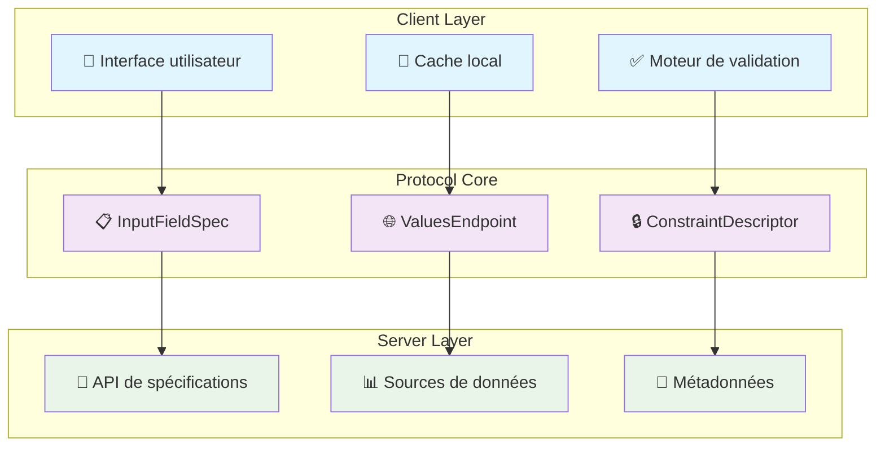
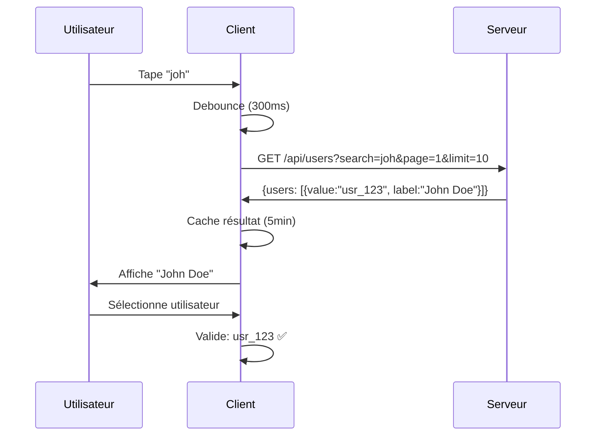
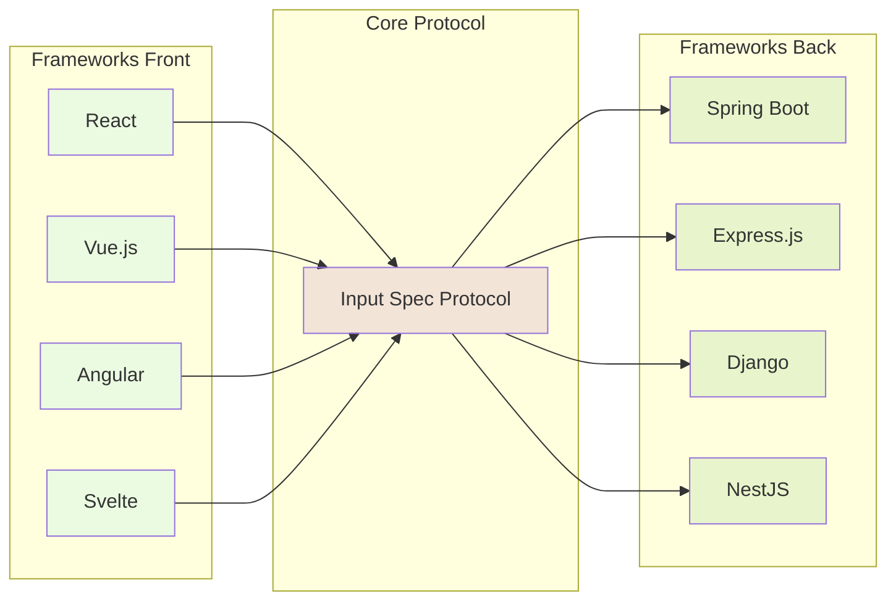

# Dynamic Input Field Specification Protocol

*Un protocole moderne pour les champs de formulaire intelligents et adaptatifs*

## 🎯 Le problème réel que nous résolvons

Combien de fois avez-vous dû coder la même logique de validation de formulaire ? Combien de fois avez-vous implémenté des dropdowns avec recherche, pagination et mise en cache ? Combien de fois avez-vous répété la validation côté client puis côté serveur ?

Le **Dynamic Input Field Specification Protocol** répond à une frustration quotidienne du développement web : **l'absence de standardisation pour spécifier dynamiquement les champs de formulaire intelligents**. 

## 🔍 Qu'est-ce que ce protocole ?

Ce protocole définit une **méthode agnostique** pour décrire complètement un champ de saisie : ses contraintes, ses sources de valeurs, ses règles de validation et son comportement. Il permet de créer des formulaires adaptatifs qui se configurent automatiquement selon les métadonnées fournies par le serveur.

### Architecture générale



## 🚫 Ce que nous ne sommes PAS

**Nous ne sommes pas** encore un autre framework de formulaires. Nous ne remplaçons pas React Hook Form, Formik ou Angular Forms. 

**Nous ne sommes pas** une nouvelle façon de valider des données. Joi, Yup et Zod excellent déjà dans ce domaine.

**Nous sommes** un **protocole de communication** qui standardise comment décrire les champs de formulaire pour que vos systèmes front/back puissent collaborer sans code dupliqué.

## ✅ Notre valeur ajoutée concrète

### Pour les développeurs front-end
- **Fini le copier-coller** de logique de validation entre projets
- **Formulaires auto-adaptatifs** basés sur les métadonnées serveur
- **Validation temps réel** avec debouncing et cache automatiques
- **Composants génériques** réutilisables entre projets

### Pour les développeurs back-end  
- **Source unique de vérité** pour les contraintes de validation
- **API uniforme** pour exposer les métadonnées de champs
- **Évolutivité** sans casser les clients existants
- **Intégration simple** avec vos endpoints existants

### Pour les équipes
- **Réduction drastique** de la maintenance de code dupliqué
- **Cohérence** automatique entre front et back
- **Onboarding facilité** avec des patterns standards
- **Time-to-market réduit** pour les nouveaux formulaires

## 🎪 Démonstration rapide

Imaginons un champ "Assigné à" dans un système de tickets :

**🖥️ Côté serveur** - Spécification du champ :
```json
{
  "displayName": "Assigné à",
  "dataType": "STRING",
  "expectMultipleValues": false,
  "required": true,
  "constraints": [{
    "name": "user_selection",
    "valuesEndpoint": {
      "uri": "/api/users",
      "searchField": "name",
      "paginationStrategy": "PAGE_NUMBER",
      "responseMapping": { "dataField": "users" }
    }
  }]
}
```

**💻 Côté client** - Rendu automatique :
```typescript
// Le composant s'adapte automatiquement à la spécification
const AssigneeField = ({ fieldSpec }) => {
  // ✅ Dropdown avec recherche automatique
  // ✅ Pagination intégrée  
  // ✅ Validation temps réel
  // ✅ Cache intelligent
  // ✅ Debouncing des requêtes
  return <SmartSelectField spec={fieldSpec} />
}
```

**🔄 Flux d'interaction** :


## 🚀 Pour qui est-ce fait ?

### ✅ Vous devriez considérer ce protocole si :
- Vous développez des applications avec **beaucoup de formulaires**
- Vous voulez **réduire la duplication** entre front et back
- Vous cherchez à **standardiser** vos patterns de validation
- Vous construisez des **systèmes multi-clients** (web, mobile, API)
- Vous voulez des **formulaires adaptatifs** et configurables

### ❌ Ce protocole n'est probablement pas pour vous si :
- Votre application a **moins de 5 formulaires** au total
- Vous préférez **tout contrôler manuellement** côté front
- Vos formulaires sont **ultra-spécifiques** sans patterns communs
- Vous n'avez **pas le contrôle du back-end**

## 📚 Commencer maintenant

### Pour les pressés (5 minutes)
👉 [Guide de démarrage rapide](./QUICK_START.md)

### Pour l'intégration (30 minutes)  
👉 [Guide intermédiaire](./INTERMEDIATE_GUIDE.md)

### Pour maîtriser le protocole (2 heures)
👉 [Guide expert](./EXPERT_GUIDE.md)

## 🏗️ Implémentations disponibles

| Langage | Status | Validation | Client HTTP | Cache | Tests |
|---------|--------|------------|-------------|--------|--------|
| **TypeScript** | ✅ Stable | ✅ Complète | ✅ Fetch/Axios | ✅ Mémoire | ✅ Jest |
| **Java** | ✅ Stable | ✅ Complète | 🚧 En cours | 🚧 En cours | ✅ JUnit |
| **Python** | 📋 Planifié | - | - | - | - |
| **C#** | 📋 Planifié | - | - | - | - |

## 🔧 Écosystème et intégrations



## 🎯 Feuille de route

### ✅ Version 1.0 (Actuelle)
- ✅ Protocole de base stabilisé
- ✅ Validation TypeScript complète
- ✅ Validation Java complète
- ✅ Documentation exhaustive

### 🚧 Version 1.1 (En cours)
- 🚧 Client HTTP Java complet
- 🚧 Système de cache Java
- 🚧 Adaptateurs React/Vue
- 🚧 Métriques de performance

### 📋 Version 2.0 (Planifiée)
- 📋 Support des validations conditionnelles
- 📋 Internationalisation native
- 📋 Validation côté serveur intégrée
- 📋 SDK Python et C#

## 🤝 Contribuer

Ce projet évolue grâce aux retours des développeurs qui l'utilisent en production. 

**Types de contributions recherchées :**
- 🐛 **Bugs** et cas d'usage non couverts
- 💡 **Améliorations** du protocole (rétrocompatibles)
- 🔌 **Adaptateurs** pour nouveaux frameworks
- 📖 **Documentation** et guides d'intégration
- 🧪 **Tests** et exemples concrets

👉 [Guide de contribution](./CONTRIBUTING.md)

## 📊 Adoption

Utilisé en production par :
- *(En cours de collecte des retours d'adoption)*

Témoignages :
- *(À venir avec les premiers utilisateurs)*

---

**🔗 Liens rapides**
- 📋 [Spécification complète du protocole](../PROTOCOL_SPECIFICATION.md)
- 🚀 [Démarrage rapide](./QUICK_START.md)
- 🎓 [Exemples TypeScript](../impl/typescript/examples/)
- ☕ [Exemples Java](../impl/java/src/test/java/)
- 🤔 [FAQ](./FAQ.md)
- 💬 [Discussions](../../discussions)

*Dernière mise à jour : Octobre 2025*