# Language selector
layout: default
title: Intermediate Guide
nav_order: 4
description: "Intermediate features, configuration, and concrete scenarios."
nav_exclude: true

[🇫🇷 French](../INTERMEDIATE_GUIDE.md) | [🇬🇧 English](./INTERMEDIATE_GUIDE.md)
# 🎓 Intermediate Guide

*Mastering the protocol for advanced use cases*

## 🎯 Guide Objectives

After mastering the basics, this guide will help you:
- 🏗️ Architect complex forms with orchestrated validation
- 🔌 Integrate the protocol with your existing frameworks
- ⚡ Optimize performance and cache management
- 🔒 Implement conditional and advanced validations
- 🌐 Handle edge cases and production robustness

## 📋 Use Case: Project Creation Form

We will build a complex project creation form that demonstrates the advanced capabilities of the protocol.

### Form Architecture

```mermaid
graph TB
  subgraph "Project Form"
    NAME[📝 Project Name]
    TYPE[🏷️ Project Type]
    LEAD[👤 Project Lead]
    TEAM[👥 Team]
    TAGS[🏷️ Tags]
    BUDGET[💰 Budget]
    DEADLINE[📅 Deadline]
    end
    
  subgraph "Dependencies"
    TYPE --> TEAM
    TYPE --> BUDGET
    LEAD --> TEAM
    end
    
  subgraph "Validations"
    NAME --> VAL1[Name uniqueness]
    LEAD --> VAL2[User permissions]
    TEAM --> VAL3[Team size by type]
    BUDGET --> VAL4[Budget limits]
    end
    
    classDef field fill:#e3f2fd
    classDef validation fill:#fff3e0
    classDef dependency fill:#f3e5f5
    
    class NAME,TYPE,LEAD,TEAM,TAGS,BUDGET,DEADLINE field
    class VAL1,VAL2,VAL3,VAL4 validation
    class TYPE,LEAD dependency
```



## 🏗️ Architecture côté serveur

### 1. Spécifications des champs avec dépendances

```typescript
// TypeScript - Configuration avancée des champs
import { InputFieldSpec, DataType, ConstraintDescriptor } from '@cyfko/input-spec';

export class ProjectFormSpecifications {
  
  // Champ nom avec validation d'unicité
  static getProjectNameSpec(): InputFieldSpec {
    return {
      displayName: "Nom du projet",
      description: "Nom unique du projet (3-50 caractères)",
      dataType: DataType.STRING,
      expectMultipleValues: false,
      required: true,
      constraints: [
        {
          name: "minLenConstraint",
          type: "minLength", 
          params: { value: 3 }
        },
        {
          name: "maxLenConstraint",
          type: "maxLength",
          params: { value: 50 }
        },
        {
          name: "formatConstraint",
          type: "pattern",
          params: { pattern: "^[a-zA-Z0-9\\s\\-_]+$" }
        }
      ],
      valuesEndpoint: {
        protocol: "HTTPS",
        uri: "/api/projects/validate-name",
        method: "POST",
        mode: "CLOSED",
        debounceMs: 500,
        minSearchLength: 3,
        responseMapping: {
          dataField: "isAvailable"
        },
        cacheStrategy: "NONE" // Pas de cache pour l'unicité
      }
    };
  }

  // Champ type avec impact sur autres champs
  static getProjectTypeSpec(): InputFieldSpec {
    return {
      displayName: "Type de projet",
      description: "Catégorie qui détermine les contraintes et options disponibles",
      dataType: DataType.STRING,
      expectMultipleValues: false,
      required: true,
      constraints: [
        {
          name: "typeSelection",
          type: "membership",
          params: { 
            allowedValues: ["SMALL", "MEDIUM", "LARGE", "RESEARCH", "MAINTENANCE"]
          }
        }
      ],
      // v2: enumValues est supprimé. Utiliser un valuesEndpoint INLINE pour les listes statiques.
      valuesEndpoint: {
        protocol: "INLINE",
        mode: "CLOSED",
        values: [
          { value: "SMALL", label: "Petit projet (1-5 personnes)" },
          { value: "MEDIUM", label: "Projet moyen (6-15 personnes)" },
          { value: "LARGE", label: "Grand projet (16+ personnes)" },
          { value: "RESEARCH", label: "Projet de recherche" },
          { value: "MAINTENANCE", label: "Maintenance" }
        ]
      }
    };
  }

  // Champ chef de projet avec validation de permissions
  static getProjectLeadSpec(): InputFieldSpec {
    return {
      displayName: "Chef de projet",
      description: "Utilisateur responsable du projet (doit avoir les permissions appropriées)",
      dataType: DataType.STRING,
      expectMultipleValues: false,
      required: true,
      valuesEndpoint: {
        protocol: "HTTPS",
        uri: "/api/users/project-leads",
        method: "GET",
        mode: "SUGGESTIONS",
        searchField: "name",
        paginationStrategy: "PAGE_NUMBER",
        debounceMs: 300,
        minSearchLength: 2,
        responseMapping: {
          dataField: "users",
          totalField: "total",
          hasNextField: "hasNext"
        },
        requestParams: {
          pageParam: "page",
          limitParam: "limit",
          searchParam: "search",
          defaultLimit: 15
        },
        cacheStrategy: "SHORT_TERM"
      }
    };
  }

  // Champ équipe avec contraintes conditionnelles
  static getTeamMembersSpec(projectType?: string): InputFieldSpec {
    const constraints: ConstraintDescriptor[] = [];

    // Contraintes conditionnelles selon le type de projet
    if (projectType) {
      const teamSizeConstraints = this.getTeamSizeConstraints(projectType);
      constraints.unshift(teamSizeConstraints);
    }

    return {
      displayName: "Membres de l'équipe",
      description: "Sélectionnez les membres qui participeront au projet",
      dataType: DataType.STRING,
      expectMultipleValues: true,
      required: false,
      constraints: [
        ...constraints
      ],
      // v2: valuesEndpoint déplacé au niveau du champ
      valuesEndpoint: {
        protocol: "HTTPS",
        uri: "/api/users/team-members",
        method: "GET",
        mode: "SUGGESTIONS",
        searchField: "name", 
        paginationStrategy: "PAGE_NUMBER",
        debounceMs: 300,
        responseMapping: {
          dataField: "users",
          totalField: "total",
          hasNextField: "hasNext"
        },
        requestParams: {
          pageParam: "page",
          limitParam: "limit", 
          searchParam: "search",
          defaultLimit: 20
        },
        cacheStrategy: "SHORT_TERM"
      }
    };
  }

  private static getTeamSizeConstraints(projectType: string): ConstraintDescriptor {
    const sizeRules = {
      'SMALL': { min: 1, max: 5 },
      'MEDIUM': { min: 2, max: 15 },
      'LARGE': { min: 5, max: 50 },
      'RESEARCH': { min: 1, max: 8 },
      'MAINTENANCE': { min: 1, max: 3 }
    };

    const rule = sizeRules[projectType] || { min: 1, max: 10 };

    return {
      name: "teamSizeConstraint",
      type: "arraySize",
      params: { 
        minItems: rule.min,
        maxItems: rule.max
      },
      errorMessage: `L'équipe doit avoir entre ${rule.min} et ${rule.max} membres pour ce type de projet`
    };
  }
}
```

### 2. Endpoints avec logique métier

```java
// Java Spring Boot - Endpoints avancés
@RestController
@RequestMapping("/api")
public class ProjectFormController {
    
    @Autowired
    private ProjectService projectService;
    
    @Autowired
    private UserService userService;
    
    // Validation de l'unicité du nom de projet
    @PostMapping("/projects/validate-name")
    public ProjectNameValidationResponse validateProjectName(
            @RequestBody ProjectNameRequest request) {
        
        boolean isAvailable = !projectService.existsByName(request.getName());
        
        ProjectNameValidationResponse response = new ProjectNameValidationResponse();
        response.setIsAvailable(isAvailable);
        response.setMessage(isAvailable ? 
            "Nom disponible" : 
            "Ce nom de projet existe déjà");
        
        return response;
    }
    
    // Recherche des chefs de projet éligibles
    @GetMapping("/users/project-leads")
    public UserSearchResponse getProjectLeads(
            @RequestParam(defaultValue = "") String search,
            @RequestParam(defaultValue = "1") int page,
            @RequestParam(defaultValue = "15") int limit) {
        
        // Filtrer uniquement les utilisateurs avec permissions de chef de projet
        PageRequest pageRequest = PageRequest.of(page - 1, limit);
        Page<User> leaders = userService.findProjectLeadersByName(search, pageRequest);
        
        List<ValueAlias> userAliases = leaders.getContent().stream()
            .map(user -> new ValueAlias(user.getId().toString(), 
                user.getFullName() + " (" + user.getDepartment() + ")"))
            .collect(Collectors.toList());
        
        UserSearchResponse response = new UserSearchResponse();
        response.setUsers(userAliases);
        response.setTotal((int) leaders.getTotalElements());
        response.setHasNext(leaders.hasNext());
        response.setPage(page);
        
        return response;
    }
    
    // Spécification de champ dynamique selon le contexte
    @GetMapping("/fields/team-members")
    public InputFieldSpec getTeamMembersSpec(
            @RequestParam(required = false) String projectType,
            @RequestParam(required = false) String projectLeadId) {
        
        // Adapter la spécification selon le contexte
        InputFieldSpec baseSpec = ProjectFormSpecifications.getTeamMembersSpec(projectType);
        
        // Exclure le chef de projet de la liste des membres
        if (projectLeadId != null) {
            ConstraintDescriptor constraint = baseSpec.getConstraints().stream()
                .filter(c -> "team_selection".equals(c.getName()))
                .findFirst()
                .orElse(null);
                
            if (constraint != null && constraint.getValuesEndpoint() != null) {
                ValuesEndpoint endpoint = constraint.getValuesEndpoint();
                // Ajouter paramètre pour exclure le chef de projet
                if (endpoint.getRequestParams() == null) {
                    endpoint.setRequestParams(new RequestParams());
                }
                Map<String, Object> additionalParams = new HashMap<>();
                additionalParams.put("excludeUserId", projectLeadId);
                // En production, utiliser une approche plus propre pour les paramètres additionnels
            }
        }
        
        return baseSpec;
    }
}
```

## 🔧 Architecture côté client avancée

### 1. Gestionnaire de formulaire orchestré

```typescript
// Client TypeScript - Orchestration avancée
import { 
  InputFieldSpec, 
  FieldValidator, 
  ValuesResolver, 
  ValidationResult 
} from '@cyfko/input-spec';

export class ProjectFormManager {
  private fieldSpecs: Map<string, InputFieldSpec> = new Map();
  private formData: Map<string, any> = new Map();
  private validationResults: Map<string, ValidationResult> = new Map();
  private fieldDependencies: Map<string, string[]> = new Map();
  
  private validator = new FieldValidator();
  private resolver: ValuesResolver;
  
  constructor(httpClient: HttpClient, cache: CacheProvider) {
    this.resolver = new ValuesResolver(httpClient, cache);
    this.setupFieldDependencies();
  }
  
  private setupFieldDependencies() {
    // Définir les dépendances entre champs
    this.fieldDependencies.set('projectType', ['teamMembers', 'budget']);
    this.fieldDependencies.set('projectLead', ['teamMembers']);
  }
  
  // Charger les spécifications avec dépendances
  async loadFieldSpec(fieldName: string, context?: Record<string, any>): Promise<InputFieldSpec> {
    let endpoint = `/api/fields/${fieldName}`;
    
    // Ajouter le contexte comme paramètres de requête
    if (context && Object.keys(context).length > 0) {
      const params = new URLSearchParams();
      Object.entries(context).forEach(([key, value]) => {
        if (value !== null && value !== undefined) {
          params.append(key, value.toString());
        }
      });
      endpoint += `?${params.toString()}`;
    }
    
    const response = await fetch(endpoint);
    const fieldSpec = await response.json();
    
    this.fieldSpecs.set(fieldName, fieldSpec);
    return fieldSpec;
  }
  
  // Mettre à jour une valeur et propager les changements
  async updateField(fieldName: string, value: any): Promise<void> {
    const oldValue = this.formData.get(fieldName);
    this.formData.set(fieldName, value);
    
    // Valider le champ modifié
    await this.validateField(fieldName);
    
    // Propager les changements aux champs dépendants
    const dependents = this.fieldDependencies.get(fieldName);
    if (dependents && oldValue !== value) {
      await this.updateDependentFields(fieldName, dependents);
    }
  }
  
  private async updateDependentFields(changedField: string, dependentFields: string[]): Promise<void> {
    const context = this.buildContext();
    
    for (const dependentField of dependentFields) {
      // Recharger la spécification avec le nouveau contexte
      await this.loadFieldSpec(dependentField, context);
      
      // Revalider le champ dépendant
      await this.validateField(dependentField);
    }
  }
  
  private buildContext(): Record<string, any> {
    return {
      projectType: this.formData.get('projectType'),
      projectLeadId: this.formData.get('projectLead'),
      teamSize: Array.isArray(this.formData.get('teamMembers')) 
        ? this.formData.get('teamMembers').length 
        : 0
    };
  }
  
  async validateField(fieldName: string): Promise<ValidationResult> {
    const fieldSpec = this.fieldSpecs.get(fieldName);
    const value = this.formData.get(fieldName);
    
    if (!fieldSpec) {
      throw new Error(`Spécification non trouvée pour le champ: ${fieldName}`);
    }
    
    const result = await this.validator.validate(fieldSpec, value);
    this.validationResults.set(fieldName, result);
    
    return result;
  }
  
  async validateForm(): Promise<{ isValid: boolean; errors: Record<string, string[]> }> {
    const errors: Record<string, string[]> = {};
    let isValid = true;
    
    // Valider tous les champs
    for (const [fieldName] of this.fieldSpecs) {
      const result = await this.validateField(fieldName);
      
      if (!result.isValid) {
        isValid = false;
        errors[fieldName] = result.errors.map(e => e.message);
      }
    }
    
    return { isValid, errors };
  }
  
  // Recherche avec cache intelligent et debouncing
  async searchValues(fieldName: string, query: string, page: number = 1): Promise<FetchValuesResult> {
    const fieldSpec = this.fieldSpecs.get(fieldName);
    
    if (!fieldSpec) {
      throw new Error(`Spécification introuvable pour le champ: ${fieldName}`);
    }
    if (!fieldSpec.valuesEndpoint) {
      throw new Error(`Pas de valuesEndpoint défini au niveau du champ (v2) pour: ${fieldName}`);
    }
    // v2: utilisation directe du fieldSpec.valuesEndpoint
    
    return this.resolver.resolveValues(fieldSpec.valuesEndpoint, {
      search: query,
      page,
      limit: fieldSpec.valuesEndpoint.requestParams?.defaultLimit || 20
    });
  }
  
  // Export des données du formulaire
  getFormData(): Record<string, any> {
    const data: Record<string, any> = {};
    this.formData.forEach((value, key) => {
      data[key] = value;
    });
    return data;
  }
  
  // Import de données existantes (mode édition)
  async setFormData(data: Record<string, any>): Promise<void> {
    // Charger d'abord toutes les spécifications de base
    await this.loadFieldSpec('projectName');
    await this.loadFieldSpec('projectType');
    await this.loadFieldSpec('projectLead');
    
    // Définir les valeurs de base
    Object.entries(data).forEach(([key, value]) => {
      this.formData.set(key, value);
    });
    
    // Charger les spécifications dépendantes avec contexte
    const context = this.buildContext();
    await this.loadFieldSpec('teamMembers', context);
    await this.loadFieldSpec('budget', context);
    
    // Valider tous les champs
    for (const [fieldName] of this.fieldSpecs) {
      await this.validateField(fieldName);
    }
  }
}
```

### 2. Composants React avancés

```typescript
// Composant React avec gestion avancée
import React, { useState, useEffect, useCallback } from 'react';
import { ProjectFormManager } from './ProjectFormManager';
import { FetchHttpClient, MemoryCacheProvider } from '@cyfko/input-spec';

const ProjectForm: React.FC<{ 
  initialData?: Record<string, any>,
  onSubmit: (data: Record<string, any>) => Promise<void> 
}> = ({ initialData, onSubmit }) => {
  
  const [formManager] = useState(() => 
    new ProjectFormManager(new FetchHttpClient(), new MemoryCacheProvider())
  );
  
  const [formData, setFormData] = useState<Record<string, any>>({});
  const [validationErrors, setValidationErrors] = useState<Record<string, string[]>>({});
  const [isLoading, setIsLoading] = useState(true);
  const [isSubmitting, setIsSubmitting] = useState(false);
  
  // Initialisation du formulaire
  useEffect(() => {
    const initializeForm = async () => {
      try {
        if (initialData) {
          await formManager.setFormData(initialData);
        } else {
          // Charger les spécifications de base pour un nouveau formulaire
          await formManager.loadFieldSpec('projectName');
          await formManager.loadFieldSpec('projectType');
          await formManager.loadFieldSpec('projectLead');
        }
        
        setFormData(formManager.getFormData());
        setIsLoading(false);
      } catch (error) {
        console.error('Erreur d\'initialisation du formulaire:', error);
        setIsLoading(false);
      }
    };
    
    initializeForm();
  }, [formManager, initialData]);
  
  // Gestionnaire de changement de champ
  const handleFieldChange = useCallback(async (fieldName: string, value: any) => {
    try {
      await formManager.updateField(fieldName, value);
      setFormData(formManager.getFormData());
      
      // Effacer les erreurs de validation précédentes pour ce champ
      setValidationErrors(prev => ({
        ...prev,
        [fieldName]: []
      }));
      
    } catch (error) {
      console.error(`Erreur de mise à jour du champ ${fieldName}:`, error);
    }
  }, [formManager]);
  
  // Soumission du formulaire
  const handleSubmit = useCallback(async (e: React.FormEvent) => {
    e.preventDefault();
    setIsSubmitting(true);
    
    try {
      const validation = await formManager.validateForm();
      
      if (validation.isValid) {
        const data = formManager.getFormData();
        await onSubmit(data);
      } else {
        setValidationErrors(validation.errors);
      }
    } catch (error) {
      console.error('Erreur de soumission:', error);
    } finally {
      setIsSubmitting(false);
    }
  }, [formManager, onSubmit]);
  
  if (isLoading) {
    return <div className="form-loading">Chargement du formulaire...</div>;
  }
  
  return (
    <form onSubmit={handleSubmit} className="project-form">
      <ProjectNameField
        value={formData.projectName || ''}
        onChange={(value) => handleFieldChange('projectName', value)}
        errors={validationErrors.projectName}
        formManager={formManager}
      />
      
      <ProjectTypeField
        value={formData.projectType || ''}
        onChange={(value) => handleFieldChange('projectType', value)}
        errors={validationErrors.projectType}
        formManager={formManager}
      />
      
      <ProjectLeadField
        value={formData.projectLead || ''}
        onChange={(value) => handleFieldChange('projectLead', value)}
        errors={validationErrors.projectLead}
        formManager={formManager}
      />
      
      {formData.projectType && (
        <TeamMembersField
          value={formData.teamMembers || []}
          onChange={(value) => handleFieldChange('teamMembers', value)}
          errors={validationErrors.teamMembers}
          formManager={formManager}
          excludeUserId={formData.projectLead}
        />
      )}
      
      <div className="form-actions">
        <button 
          type="submit" 
          disabled={isSubmitting}
          className="submit-button"
        >
          {isSubmitting ? 'Création...' : 'Créer le projet'}
        </button>
      </div>
    </form>
  );
};
```

## ⚡ Optimisations de performance

### 1. Stratégies de cache avancées

```typescript
// Cache provider avec éviction intelligente
export class IntelligentCacheProvider implements CacheProvider {
  private cache = new Map<string, CacheEntry>();
  private maxSize = 1000;
  private metrics = {
    hits: 0,
    misses: 0,
    evictions: 0
  };
  
  get<T>(key: string): T | null {
    const entry = this.cache.get(key);
    
    if (!entry) {
      this.metrics.misses++;
      return null;
    }
    
    if (this.isExpired(entry)) {
      this.cache.delete(key);
      this.metrics.misses++;
      return null;
    }
    
    // Mettre à jour l'usage pour LRU
    entry.lastAccessed = Date.now();
    this.metrics.hits++;
    
    return entry.value as T;
  }
  
  set<T>(key: string, value: T, ttlMs?: number): void {
    // Éviction si cache plein
    if (this.cache.size >= this.maxSize) {
      this.evictLeastRecentlyUsed();
    }
    
    const entry: CacheEntry = {
      value,
      createdAt: Date.now(),
      lastAccessed: Date.now(),
      expiresAt: ttlMs ? Date.now() + ttlMs : undefined
    };
    
    this.cache.set(key, entry);
  }
  
  private evictLeastRecentlyUsed(): void {
    let oldestKey = '';
    let oldestTime = Infinity;
    
    for (const [key, entry] of this.cache) {
      if (entry.lastAccessed < oldestTime) {
        oldestTime = entry.lastAccessed;
        oldestKey = key;
      }
    }
    
    if (oldestKey) {
      this.cache.delete(oldestKey);
      this.metrics.evictions++;
    }
  }
  
  getMetrics() {
    const total = this.metrics.hits + this.metrics.misses;
    return {
      ...this.metrics,
      hitRate: total > 0 ? this.metrics.hits / total : 0,
      size: this.cache.size
    };
  }
}

interface CacheEntry {
  value: any;
  createdAt: number;
  lastAccessed: number;
  expiresAt?: number;
}
```

### 2. Batch validation et optimisations réseau

```typescript
// Validation par batch pour formulaires complexes
export class BatchValidator {
  private pendingValidations = new Map<string, Promise<ValidationResult>>();
  private validationQueue: ValidationRequest[] = [];
  private batchTimeout?: NodeJS.Timeout;
  
  async validate(
    fieldName: string, 
    fieldSpec: InputFieldSpec, 
    value: any
  ): Promise<ValidationResult> {
    
    // Si validation déjà en cours, retourner la promesse existante
    const existing = this.pendingValidations.get(fieldName);
    if (existing) {
      return existing;
    }
    
    // Pour les validations côté serveur, utiliser le batching
    if (this.requiresServerValidation(fieldSpec)) {
      return this.scheduleServerValidation(fieldName, fieldSpec, value);
    }
    
    // Validation locale immédiate
    const validator = new FieldValidator();
    return validator.validate(fieldSpec, value);
  }
  
  private scheduleServerValidation(
    fieldName: string,
    fieldSpec: InputFieldSpec,
    value: any
  ): Promise<ValidationResult> {
    
    const promise = new Promise<ValidationResult>((resolve, reject) => {
      this.validationQueue.push({
        fieldName,
        fieldSpec,
        value,
        resolve,
        reject
      });
    });
    
    this.pendingValidations.set(fieldName, promise);
    
    // Démarrer le timer de batch si pas déjà en cours
    if (!this.batchTimeout) {
      this.batchTimeout = setTimeout(() => {
        this.processBatch();
      }, 200); // Attendre 200ms pour grouper les validations
    }
    
    return promise;
  }
  
  private async processBatch(): Promise<void> {
    if (this.validationQueue.length === 0) {
      return;
    }
    
    const batch = [...this.validationQueue];
    this.validationQueue = [];
    this.batchTimeout = undefined;
    
    try {
      // Grouper par endpoint de validation
      const endpointGroups = new Map<string, ValidationRequest[]>();
      
      batch.forEach(request => {
        const endpoint = this.getValidationEndpoint(request.fieldSpec);
        if (endpoint) {
          if (!endpointGroups.has(endpoint)) {
            endpointGroups.set(endpoint, []);
          }
          endpointGroups.get(endpoint)!.push(request);
        }
      });
      
      // Exécuter les validations par groupe
      for (const [endpoint, requests] of endpointGroups) {
        await this.validateBatchForEndpoint(endpoint, requests);
      }
      
    } catch (error) {
      // En cas d'erreur, rejeter toutes les promesses
      batch.forEach(request => request.reject(error));
    } finally {
      // Nettoyer les validations en attente
      batch.forEach(request => {
        this.pendingValidations.delete(request.fieldName);
      });
    }
  }
}
```

## 🔒 Sécurité et validation robuste

### 1. Validation côté serveur avec sanitisation

```java
// Java - Validation sécurisée côté serveur
@Service
public class SecureFieldValidator {
    
    private static final int MAX_STRING_LENGTH = 10000;
    private static final int MAX_ARRAY_SIZE = 1000;
    
    @Autowired
    private InputSanitizer sanitizer;
    
    public ValidationResult validateSecurely(
            InputFieldSpec fieldSpec, 
            Object value, 
            SecurityContext context) {
        
        List<ValidationError> errors = new ArrayList<>();
        
        try {
            // 1. Sanitisation préventive
            Object sanitizedValue = sanitizer.sanitize(value, fieldSpec.getDataType());
            
            // 2. Validation des limites de sécurité
            errors.addAll(validateSecurityLimits(sanitizedValue, fieldSpec));
            
            // 3. Validation des permissions contextuelles
            errors.addAll(validatePermissions(fieldSpec, context));
            
            // 4. Validation métier standard
            if (errors.isEmpty()) {
                FieldValidator validator = new FieldValidator();
                ValidationResult standardResult = validator.validate(fieldSpec, sanitizedValue);
                errors.addAll(standardResult.getErrors());
            }
            
        } catch (SecurityException e) {
            errors.add(new ValidationError("security", 
                "Violation de sécurité détectée: " + e.getMessage()));
        }
        
        return new ValidationResult(errors.isEmpty(), errors);
    }
    
    private List<ValidationError> validateSecurityLimits(Object value, InputFieldSpec fieldSpec) {
        List<ValidationError> errors = new ArrayList<>();
        
        if (fieldSpec.getDataType() == DataType.STRING && value instanceof String) {
            String str = (String) value;
            if (str.length() > MAX_STRING_LENGTH) {
                errors.add(new ValidationError("security", 
                    "Chaîne trop longue (max: " + MAX_STRING_LENGTH + ")"));
            }
        }
        
        if (fieldSpec.isExpectMultipleValues() && value instanceof List) {
            List<?> list = (List<?>) value;
            if (list.size() > MAX_ARRAY_SIZE) {
                errors.add(new ValidationError("security", 
                    "Tableau trop grand (max: " + MAX_ARRAY_SIZE + ")"));
            }
        }
        
        return errors;
    }
    
    private List<ValidationError> validatePermissions(
            InputFieldSpec fieldSpec, 
            SecurityContext context) {
        
        List<ValidationError> errors = new ArrayList<>();
        
        // Exemple: certains champs nécessitent des permissions spéciales
        if ("budget".equals(fieldSpec.getDisplayName()) && 
            !context.hasRole("BUDGET_MANAGER")) {
            errors.add(new ValidationError("permission", 
                "Permissions insuffisantes pour modifier le budget"));
        }
        
        return errors;
    }
}
```

## 📊 Monitoring et analytics

### 1. Métriques de performance des formulaires

```typescript
// Analytics et monitoring
export class FormAnalytics {
  private metrics = {
    validationTimes: new Map<string, number[]>(),
    searchTimes: new Map<string, number[]>(),
    errorRates: new Map<string, number>(),
    abandonmentPoints: new Map<string, number>()
  };
  
  trackValidation(fieldName: string, duration: number, isValid: boolean) {
    // Enregistrer les temps de validation
    if (!this.metrics.validationTimes.has(fieldName)) {
      this.metrics.validationTimes.set(fieldName, []);
    }
    this.metrics.validationTimes.get(fieldName)!.push(duration);
    
    // Tracker le taux d'erreur
    if (!isValid) {
      const current = this.metrics.errorRates.get(fieldName) || 0;
      this.metrics.errorRates.set(fieldName, current + 1);
    }
  }
  
  trackSearchPerformance(fieldName: string, query: string, duration: number, resultCount: number) {
    if (!this.metrics.searchTimes.has(fieldName)) {
      this.metrics.searchTimes.set(fieldName, []);
    }
    this.metrics.searchTimes.get(fieldName)!.push(duration);
    
    // Envoyer à un service d'analytics
    this.sendSearchMetrics({
      fieldName,
      query: query.length, // Ne pas envoyer la query exacte pour la confidentialité
      duration,
      resultCount,
      timestamp: Date.now()
    });
  }
  
  getPerformanceReport(): FormPerformanceReport {
    const report: FormPerformanceReport = {
      fields: {}
    };
    
    for (const [fieldName, times] of this.metrics.validationTimes) {
      const avgTime = times.reduce((a, b) => a + b, 0) / times.length;
      const errorRate = this.metrics.errorRates.get(fieldName) || 0;
      
      report.fields[fieldName] = {
        avgValidationTime: avgTime,
        errorRate: errorRate / times.length,
        totalValidations: times.length
      };
    }
    
    return report;
  }
  
  private async sendSearchMetrics(metrics: SearchMetrics) {
    try {
      await fetch('/api/analytics/search', {
        method: 'POST',
        headers: { 'Content-Type': 'application/json' },
        body: JSON.stringify(metrics)
      });
    } catch (error) {
      // Fail silently pour ne pas impacter l'UX
      console.debug('Analytics send failed:', error);
    }
  }
}

interface FormPerformanceReport {
  fields: Record<string, {
    avgValidationTime: number;
    errorRate: number;
    totalValidations: number;
  }>;
}
```

## 🎯 Advanced Use Cases

### 1. Complex Conditional Forms

```typescript
// Managing forms with advanced conditional logic
export class ConditionalFormBuilder {
  
  buildProjectForm(userRole: string, projectContext?: ProjectContext): FormConfiguration {
    const config: FormConfiguration = {
      fields: [],
      layout: 'vertical',
      submitButton: { text: 'Créer le projet', variant: 'primary' }
    };
    
  // Base fields for all users
    config.fields.push(
      this.createField('projectName', { required: true }),
      this.createField('projectDescription', { required: false })
    );
    
  // Conditional fields by role
    if (userRole === 'PROJECT_MANAGER' || userRole === 'ADMIN') {
      config.fields.push(
        this.createField('projectType', { required: true }),
        this.createField('projectLead', { required: true })
      );
    }
    
    if (userRole === 'ADMIN') {
      config.fields.push(
        this.createField('budget', { required: false }),
        this.createField('priority', { required: true })
      );
    }
    
  // Adapt according to edit context
    if (projectContext?.isEditing) {
      config.submitButton.text = 'Mettre à jour';
    // Pre-fill existing values
      config.initialData = projectContext.existingData;
    }
    
    return config;
  }
  
  private createField(name: string, options: FieldOptions): FieldConfiguration {
    return {
      name,
      spec: () => this.loadFieldSpec(name, options),
      validation: options.required ? 'immediate' : 'onBlur',
      layout: options.layout || 'default'
    };
  }
}
```

## 🎉 Conclusion

This intermediate guide showed you how to:

- 🏗️ **Architect complex forms** with dependency management
- ⚡ **Optimize performance** with smart cache and batch validation
- 🔒 **Secure your validations** on both server and client
- 📊 **Monitor performance** to optimize user experience
- 🎯 **Handle advanced use cases** with conditional logic

### Next steps

1. 🔧 [Expert Guide](./EXPERT_GUIDE.md) – Internal architecture and contributions
2. 📚 [Concrete examples](../impl/typescript/examples/) – Complete implementations
3. 🤝 [Contributions](./CONTRIBUTING.md) – Participate in development

---

*Estimated time: 30-45 minutes • Difficulty: Intermediate*