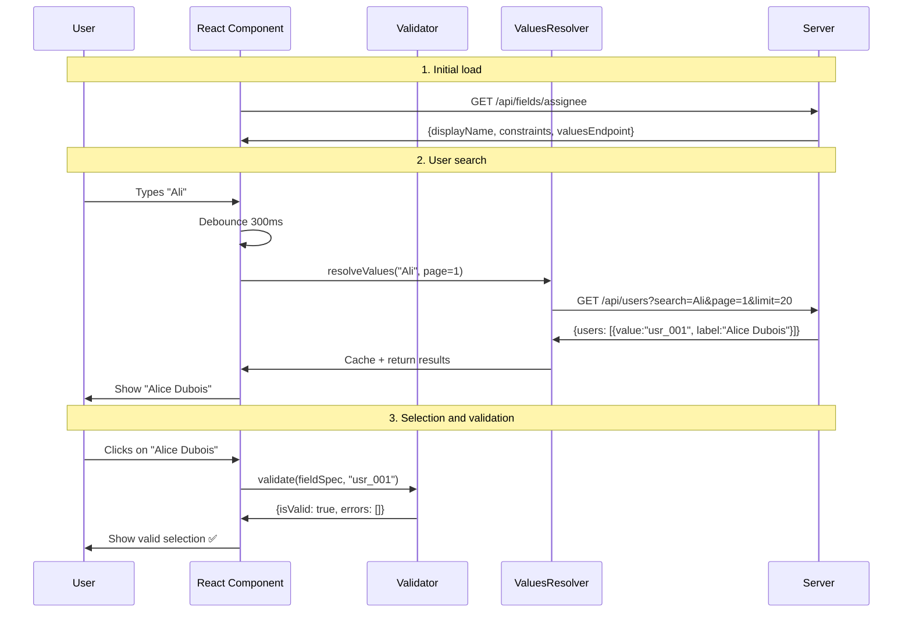

layout: default
title: Quick Start
nav_order: 3
description: "Get started quickly with the protocol on client and server."

[🇫🇷 French](../QUICK_START.md) | [🇬🇧 English](./QUICK_START.md)

# 🚀 Quick Start Guide

*From zero to your first smart field in 5 minutes*

## 🎯 Goal

Create a user selection field with real-time search and automatic validation using the Dynamic Input Field Specification Protocol.

## 🏁 Expected Result

At the end of this guide, you will have:
- ✅ A selection field with real-time search
- ✅ Automatic client-side validation
- ✅ Integrated pagination for large datasets
- ✅ Smart cache to optimize performance

## 📦 Installation

### TypeScript/JavaScript

```bash
npm install @cyfko/input-spec
# or
yarn add @cyfko/input-spec
```

### Java (Maven)

```xml
<dependency>
  <groupId>io.github.cyfko</groupId>
  <artifactId>input-spec</artifactId>
  <version>2.0.0</version>
</dependency>
```

## 🎬 Scenario: "Assigned To" Field

Imagine you are developing a ticketing system and need to create a field to assign tickets to users.

### Step 1: Server Side – Define the Specification

```typescript
// TypeScript/Node.js
import { InputFieldSpec, DataType } from '@cyfko/input-spec';

const assigneeFieldSpec: InputFieldSpec = {
  displayName: "Assigned To",
  description: "Select the user responsible for the ticket",
  dataType: DataType.STRING,
  expectMultipleValues: false,
  required: true,
  valuesEndpoint: {
    protocol: "HTTPS",
    uri: "/api/users",
    method: "GET",
    searchField: "name",
    paginationStrategy: "PAGE_NUMBER",
    debounceMs: 300,
    minSearchLength: 2,
    responseMapping: { dataField: "users", totalField: "total", hasNextField: "hasNext" },
    requestParams: { pageParam: "page", limitParam: "limit", searchParam: "search", defaultLimit: 20 },
    cacheStrategy: "SHORT_TERM",
    mode: "CLOSED"
  },
  constraints: [
  { name: "pattern_id", type: "pattern", params: { regex: "^[A-Za-z0-9_]+$" }, errorMessage: "Invalid user identifier" }
  ]
};
```

```java
// Java/Spring Boot
import io.github.cyfko.inputspec.*;

@RestController
public class FieldSpecController {
    
    @GetMapping("/api/fields/assignee")
    public InputFieldSpec getAssigneeField() {
    ValuesEndpoint usersEndpoint = ValuesEndpoint.builder()
      .protocol(Protocol.HTTPS)
      .uri("/api/users")
      .searchField("name")
      .paginationStrategy(PaginationStrategy.PAGE_NUMBER)
      .debounceMs(300)
      .mode(DomainMode.CLOSED)
      .responseMapping(ResponseMapping.builder()
        .dataField("users")
        .totalField("total")
        .hasNextField("hasNext")
        .build())
      .requestParams(RequestParams.builder()
        .pageParam("page")
        .limitParam("limit")
        .searchParam("search")
        .defaultLimit(20)
        .build())
      .build();

    ConstraintDescriptor pattern = ConstraintDescriptor.builder()
      .name("pattern_id")
      .type("pattern")
      .errorMessage("Identifiant utilisateur invalide")
      .putParam("regex", "^[A-Za-z0-9_]+$")
      .build();

    return InputFieldSpec.builder("Assigned To", DataType.STRING)
      .description("Select the user responsible for the ticket")
      .required(true)
      .expectMultipleValues(false)
      .valuesEndpoint(usersEndpoint)
      .constraints(List.of(pattern))
      .build();
    }
}
```

### Step 2: Server Side – Values Endpoint

Create the `/api/users` endpoint that returns the list of users:

```typescript
// Express.js exemple
app.get('/api/users', (req, res) => {
  const { search = '', page = 1, limit = 20 } = req.query;
  
  // Simulate a database search
  const allUsers = [
    { value: "usr_001", label: "Alice Dubois" },
    { value: "usr_002", label: "Bob Martin" },
    { value: "usr_003", label: "Claire Durand" },
    { value: "usr_004", label: "David Moreau" },
    // ... plus d'utilisateurs
  ];
  
  // Filter by search
  const filteredUsers = allUsers.filter(user => 
    user.label.toLowerCase().includes(search.toLowerCase())
  );
  
  // Pagination
  const startIndex = (parseInt(page) - 1) * parseInt(limit);
  const endIndex = startIndex + parseInt(limit);
  const paginatedUsers = filteredUsers.slice(startIndex, endIndex);
  
  res.json({
    users: paginatedUsers,
    total: filteredUsers.length,
    hasNext: endIndex < filteredUsers.length,
    page: parseInt(page)
  });
});
```

```java
// Spring Boot example
@RestController
public class UsersController {
    
    @GetMapping("/api/users")
    public UserSearchResponse searchUsers(
        @RequestParam(defaultValue = "") String search,
        @RequestParam(defaultValue = "1") int page,
        @RequestParam(defaultValue = "20") int limit) {
        
  // Simulate database search
        List<ValueAlias> allUsers = Arrays.asList(
            new ValueAlias("usr_001", "Alice Dubois"),
            new ValueAlias("usr_002", "Bob Martin"),
            new ValueAlias("usr_003", "Claire Durand"),
            new ValueAlias("usr_004", "David Moreau")
        );
        
  // Filtering and pagination
        List<ValueAlias> filtered = allUsers.stream()
            .filter(user -> user.getLabel().toLowerCase()
                .contains(search.toLowerCase()))
            .skip((page - 1) * limit)
            .limit(limit)
            .collect(Collectors.toList());
        
        UserSearchResponse response = new UserSearchResponse();
        response.setUsers(filtered);
        response.setTotal(allUsers.size());
        response.setHasNext((page * limit) < allUsers.size());
        response.setPage(page);
        
        return response;
    }
}
```

### Step 3: Client Side – Validation and Resolution

```typescript
// Client TypeScript
import { FieldValidator, ValuesResolver, FetchHttpClient, MemoryCacheProvider } from '@cyfko/input-spec';

// Configuration du client
const httpClient = new FetchHttpClient();
const cache = new MemoryCacheProvider();
const validator = new FieldValidator();
const resolver = new ValuesResolver(httpClient, cache);

// Function to fetch field specifications
async function loadFieldSpec(): Promise<InputFieldSpec> {
  const response = await fetch('/api/fields/assignee');
  return response.json();
}

// Function to search users
async function searchUsers(query: string, page: number = 1) {
  const fieldSpec = await loadFieldSpec();
  if (!fieldSpec.valuesEndpoint) throw new Error('Pas d\'endpoint de valeurs configuré');
  return resolver.resolveValues(fieldSpec.valuesEndpoint, {
    search: query,
    page,
    limit: 20
  });
}

// Function to validate a selection
async function validateSelection(selectedUserId: string) {
  const fieldSpec = await loadFieldSpec();
  return validator.validate(fieldSpec, selectedUserId);
}
```

### Step 4: Client Side – User Interface

Here is an example with a simple React component:

```typescript
import React, { useState, useEffect, useMemo } from 'react';
import { useDebounce } from './hooks/useDebounce';

const AssigneeSelector: React.FC = () => {
  const [query, setQuery] = useState('');
  const [selectedUser, setSelectedUser] = useState<string>('');
  const [users, setUsers] = useState<ValueAlias[]>([]);
  const [isLoading, setIsLoading] = useState(false);
  const [validation, setValidation] = useState<ValidationResult | null>(null);
  
  const debouncedQuery = useDebounce(query, 300);
  
  // Effect to load users when the search changes
  useEffect(() => {
    if (debouncedQuery.length >= 2) {
      setIsLoading(true);
      searchUsers(debouncedQuery)
        .then(result => {
          setUsers(result.values);
          setIsLoading(false);
        })
        .catch(err => {
          console.error('Erreur de recherche:', err);
          setIsLoading(false);
        });
    }
  }, [debouncedQuery]);
  
  // Effect to validate the selection
  useEffect(() => {
    if (selectedUser) {
      validateSelection(selectedUser)
        .then(result => setValidation(result));
    }
  }, [selectedUser]);
  
  return (
    <div className="assignee-selector">
  <label htmlFor="assignee-search">Assigned To *</label>
      
      <input
        id="assignee-search"
        type="text"
        value={query}
        onChange={(e) => setQuery(e.target.value)}
  placeholder="Search for a user..."
        className={validation && !validation.isValid ? 'error' : ''}
      />
      
  {isLoading && <div className="loading">Searching...</div>}
      
      {users.length > 0 && (
        <div className="user-dropdown">
          {users.map(user => (
            <div
              key={user.value}
              className={`user-option ${selectedUser === user.value ? 'selected' : ''}`}
              onClick={() => {
                setSelectedUser(user.value);
                setQuery(user.label);
              }}
            >
              {user.label}
            </div>
          ))}
        </div>
      )}
      
      {validation && !validation.isValid && (
        <div className="validation-errors">
          {validation.errors.map((error, index) => (
            <div key={index} className="error-message">
              {error.message}
            </div>
          ))}
        </div>
      )}
    </div>
  );
};
```

## 🎭 Complete Flow Demonstration

Here is what happens when the user interacts with the field:



## ✅ Final Checks

If everything works, you should have:

1. **Real-time search** – Type a few letters and see results
2. **Automatic debouncing** – No request on every keystroke
3. **Smart cache** – Repeated searches are instant
4. **Real-time validation** – Immediate feedback on validity
5. **Pagination** – For large user lists

## 🐛 Common Troubleshooting

### Problem: No search results
**Solution:** Check that your `/api/users` endpoint returns the expected structure with the `users` field.

### Problem: Validation always fails
**Solution:** Make sure the selected value matches a `value` returned by the endpoint.

### Problem: No debouncing
**Solution:** Check that `debounceMs` is set in your `ValuesEndpoint`.

## 🎯 Next Steps

Now that you know the basics:

1. 📖 [Intermediate Guide](./INTERMEDIATE_GUIDE.md) – Advanced integrations and optimizations
2. 🎓 [Complete examples](../impl/typescript/examples/) – Complex forms and real-world use cases
3. 🔧 [Expert Guide](./EXPERT_GUIDE.md) – Internal architecture and contributions

## 💡 Improvement Ideas for Your Implementation

- **Multi-select**: Change `expectMultipleValues: true` for a multi-user field
- **Conditional validation**: Add dynamic constraints based on context
- **Internationalization**: Adapt `errorMessage` to the language
- **Metrics**: Track search performance to optimize

---

**🎉 Congratulations!** You have just created your first smart field with the Dynamic Input Field Specification Protocol.

*Estimated time: 5-10 minutes • Difficulty: Beginner*