[🇫🇷 Français](./index.md) | [🇬🇧 English](./en/index.md)

# Complete Documentation - Input Field Specification Protocol

Welcome to the official documentation for the **Dynamic Input Field Specification Protocol**!

This site will guide you through all aspects of the protocol, from getting started to advanced implementation techniques.

## 🧭 Navigation by goal

### 💡 Discover the protocol
**To understand the purpose and possibilities**

- [📖 Protocol overview](./OVERVIEW.md) - Philosophy and abstraction
- [📋 Main README](../../README.md) - Introduction and quick examples
- [❓ FAQ](./FAQ.md) - Frequently asked questions with concrete scenarios

### 🚀 Get started quickly
**To create your first smart field in 5 minutes**

- [🚀 Quick Start](./QUICK_START.md) - Your first smart field
- [📋 Protocol specification](../../PROTOCOL_SPECIFICATION.md) - Technical reference

### 🎓 Build complex forms
**To master advanced features**

- [🎓 Intermediate Guide](./INTERMEDIATE_GUIDE.md) - Complex forms and optimizations
- [💼 Concrete examples](./FAQ.md#concrete-examples) - E-commerce and HR scenarios

### 🔧 Contribute to the project
**To help the protocol evolve**

- [🔧 Expert Guide](./EXPERT_GUIDE.md) - Advanced architecture and development
- [🤝 Contribution Guide](./CONTRIBUTING.md) - How to participate

## 🗺️ Documentation map

```mermaid
graph TD
    A[📖 README] --> B{Your level?}
    
    B -->|Beginner| C[🚀 Quick<br/>Start]
    B -->|Intermediate| D[🎓 Intermediate<br/>Guide] 
    B -->|Expert| E[🔧 Expert<br/>Guide]
    
    C --> F[❓ FAQ]
    D --> F
    E --> G[🤝 Contribution]
    
    F --> H[📋 Protocol<br/>specification]
    G --> H
    
    style A fill:#e1f5fe
    style C fill:#f3e5f5
    style D fill:#fff3e0
    style E fill:#e8f5e8
    style F fill:#fce4ec
    style G fill:#fff8e1
    style H fill:#f1f8e9
```

## 🎯 Recommended paths

### 👨‍💻 Frontend developer
1. [Protocol overview](../../README.md#vue-densemble) 
2. [Quick Start](./QUICK_START.md) - TypeScript
3. [Intermediate Guide](./INTERMEDIATE_GUIDE.md) - Framework integrations
4. [FAQ](./FAQ.md) - Advanced scenarios

### 👩‍💻 Backend developer
1. [Protocol specification](../../PROTOCOL_SPECIFICATION.md)
2. [Expert Guide](./EXPERT_GUIDE.md) - Server implementation
3. [FAQ](./FAQ.md) - Endpoints and security
4. [Contribution](./CONTRIBUTING.md) - New implementations

### 🏗️ System architect
1. [Architecture](./EXPERT_GUIDE.md#architecture-du-protocole)
2. [Use cases](../../README.md#cas-dusage-idéaux)
3. [FAQ](./FAQ.md) - Enterprise scenarios
4. [Roadmap](../../README.md#roadmap)

### 🎨 UX/UI designer
1. [Protocol overview](../../README.md#vue-densemble)
2. [Concrete examples](./FAQ.md#concrete-examples)
3. [Intermediate Guide](./INTERMEDIATE_GUIDE.md) - UI components
4. [FAQ](./FAQ.md) - User experience

## 🛠️ Available technologies

### Ready implementations

| Technology | Level | Guide | Status |
|------------|-------|-------|--------|
| **TypeScript** | All levels | [Quick Start](./QUICK_START.md) | ✅ Stable |
| **Java** | Intermediate | [Expert Guide](./EXPERT_GUIDE.md) | 🚧 Beta |

### Framework integrations

| Framework | Guide | Examples |
|----------|-------|----------|
| **React** | [Intermediate Guide](./INTERMEDIATE_GUIDE.md#react) | [E-commerce form](./FAQ.md#scenario-1-e-commerce) |
| **Vue.js** | [Intermediate Guide](./INTERMEDIATE_GUIDE.md#vuejs) | [HR app](./FAQ.md#scenario-2-application-rh) |
| **Angular** | [Intermediate Guide](./INTERMEDIATE_GUIDE.md#angular) | [Ticket system](./FAQ.md#scenario-3-système-de-tickets) |

## 📚 Additional resources

### 🔗 External links
- [GitHub Repository](https://github.com/cyfko/input-spec) - Source code and issues
- [npm Package](https://www.npmjs.com/package/@cyfko/input-spec) - TypeScript install
- [Maven Central](https://search.maven.org/artifact/io.github.cyfko/input-spec) - Java dependency

### 📊 Community
- [GitHub Issues](https://github.com/cyfko/input-spec/issues) - Bugs and requests
- [GitHub Discussions](https://github.com/cyfko/input-spec/discussions) - Questions and exchanges
- [Pull Requests](https://github.com/cyfko/input-spec/pulls) - Ongoing contributions

## 🆘 Need help?

### Frequently asked questions
- **"What is the minimum required level?"** → [Prerequisites](./QUICK_START.md#prérequis)
- **"Compatible with my framework?"** → [Integrations](./INTERMEDIATE_GUIDE.md#intégrations-frameworks)
- **"How to contribute?"** → [Contribution Guide](./CONTRIBUTING.md)

### Support
- 🐛 **Bugs**: [Create an issue](https://github.com/cyfko/input-spec/issues/new?template=bug_report.md)
- 💡 **Ideas**: [Start a discussion](https://github.com/cyfko/input-spec/discussions/new?category=ideas)
- 📖 **Docs**: [Improve this page](./CONTRIBUTING.md#documentation)

---

## 🚦 Documentation status

| Document | Last update | Status | Contributors |
|----------|-------------|--------|--------------|
| [README](../../README.md) | Oct 2025 | ✅ Up to date | Core team |
| [Quick Start](./QUICK_START.md) | Oct 2025 | ✅ Up to date | Core team |
| [Intermediate Guide](./INTERMEDIATE_GUIDE.md) | Oct 2025 | ✅ Up to date | Core team |
| [Expert Guide](./EXPERT_GUIDE.md) | Oct 2025 | ✅ Up to date | Core team |
| [FAQ](./FAQ.md) | Oct 2025 | ✅ Up to date | Core team |
| [Contribution](./CONTRIBUTING.md) | Oct 2025 | ✅ Up to date | Core team |

---

**Documentation generated with ❤️ by the community**  
*Suggestions for improvement? [Contribute to this page!](./CONTRIBUTING.md)*
