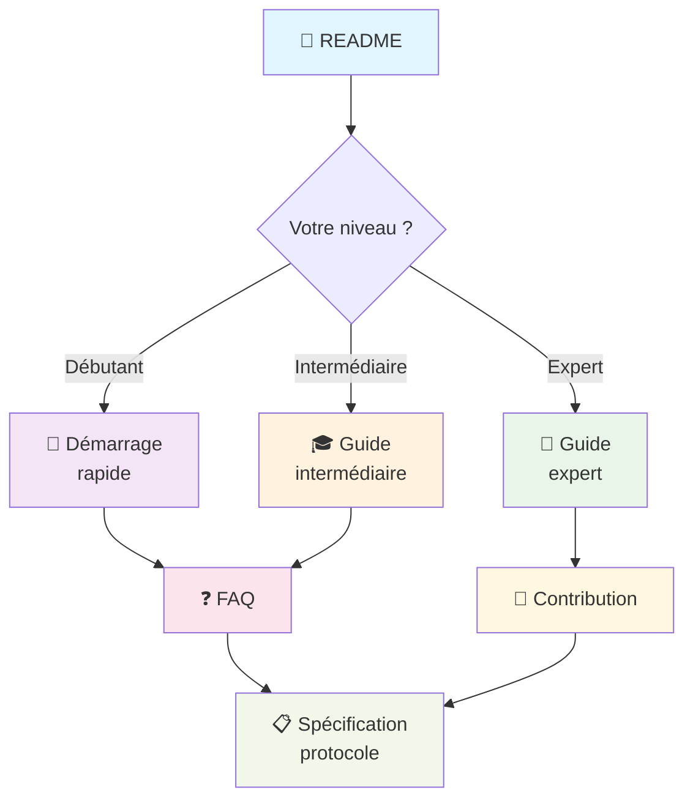

# Documentation Complète - Input Field Specification Protocol

Bienvenue dans la documentation complète du **Dynamic Input Field Specification Protocol** ! 

Ce site vous guidera à travers tous les aspects du protocole, depuis vos premiers pas jusqu'aux techniques avancées d'implémentation.

## 🧭 Navigation par objectif

### 💡 Découvrir le protocole
**Pour comprendre l'intérêt et les possibilités**

- [📖 README principal](../README.md) - Vue d'ensemble et exemple rapide
- [❓ FAQ](./FAQ.md) - Questions fréquentes avec scénarios concrets

### 🚀 Commencer rapidement  
**Pour créer votre premier champ intelligent en 5 minutes**

- [🚀 Démarrage rapide](./QUICK_START.md) - Votre premier champ intelligent
- [📋 Spécification protocole](../PROTOCOL_SPECIFICATION.md) - Référence technique

### 🎓 Développer des formulaires complexes
**Pour maîtriser les fonctionnalités avancées**

- [🎓 Guide intermédiaire](./INTERMEDIATE_GUIDE.md) - Formulaires complexes et optimisations
- [💼 Exemples concrets](./FAQ.md#exemples-concrets) - Scénarios e-commerce et RH

### 🔧 Contribuer au projet
**Pour participer à l'évolution du protocole**

- [🔧 Guide expert](./EXPERT_GUIDE.md) - Architecture et développement avancé
- [🤝 Guide de contribution](./CONTRIBUTING.md) - Comment participer

## 🗺️ Plan de la documentation

## 🎯 Parcours recommandés

### 👨‍💻 Développeur front-end
1. [Vue d'ensemble](../README.md#vue-densemble) 
2. [Démarrage rapide](./QUICK_START.md) - TypeScript
3. [Guide intermédiaire](./INTERMEDIATE_GUIDE.md) - Intégrations frameworks
4. [FAQ](./FAQ.md) - Scénarios avancés

### 👩‍💻 Développeur back-end
1. [Spécification protocole](../PROTOCOL_SPECIFICATION.md)
2. [Guide expert](./EXPERT_GUIDE.md) - Implémentation serveur
3. [FAQ](./FAQ.md) - Endpoints et sécurité
4. [Contribution](./CONTRIBUTING.md) - Nouvelles implémentations

### 🏗️ Architecte système
1. [Architecture](./EXPERT_GUIDE.md#architecture-du-protocole)
2. [Cas d'usage](../README.md#cas-dusage-idéaux)
3. [FAQ](./FAQ.md) - Scénarios entreprise
4. [Roadmap](../README.md#roadmap)

### 🎨 Designer UX/UI
1. [Vue d'ensemble](../README.md#vue-densemble)
2. [Exemples concrets](./FAQ.md#exemples-concrets)
3. [Guide intermédiaire](./INTERMEDIATE_GUIDE.md) - Composants UI
4. [FAQ](./FAQ.md) - Expérience utilisateur

## 🛠️ Technologies disponibles

### Implémentations prêtes

| Technologie | Niveau | Guide | Statut |
|-------------|--------|-------|--------|
| **TypeScript** | Tous niveaux | [Démarrage rapide](./QUICK_START.md) | ✅ Stable |
| **Java** | Intermédiaire | [Guide expert](./EXPERT_GUIDE.md) | 🚧 Beta |

### Intégrations frameworks

| Framework | Guide | Exemples |
|-----------|-------|----------|
| **React** | [Guide intermédiaire](./INTERMEDIATE_GUIDE.md#react) | [Formulaire e-commerce](./FAQ.md#scénario-1-e-commerce) |
| **Vue.js** | [Guide intermédiaire](./INTERMEDIATE_GUIDE.md#vuejs) | [Application RH](./FAQ.md#scénario-2-application-rh) |
| **Angular** | [Guide intermédiaire](./INTERMEDIATE_GUIDE.md#angular) | [Système tickets](./FAQ.md#scénario-3-système-de-tickets) |

## 📚 Ressources complémentaires

### 🔗 Liens externes
- [Repository GitHub](https://github.com/cyfko/input-spec) - Code source et issues
- [Package npm](https://www.npmjs.com/package/@cyfko/input-spec) - Installation TypeScript
- [Maven Central](https://search.maven.org/artifact/io.github.cyfko/input-spec) - Dépendance Java

### 📊 Communauté
- [GitHub Issues](https://github.com/cyfko/input-spec/issues) - Bugs et demandes
- [GitHub Discussions](https://github.com/cyfko/input-spec/discussions) - Questions et échanges
- [Pull Requests](https://github.com/cyfko/input-spec/pulls) - Contributions en cours

## 🆘 Besoin d'aide ?

### Questions fréquentes
- **"Quel niveau minimum requis ?"** → [Prérequis](./QUICK_START.md#prérequis)
- **"Compatible avec mon framework ?"** → [Intégrations](./INTERMEDIATE_GUIDE.md#intégrations-frameworks)
- **"Comment contribuer ?"** → [Guide de contribution](./CONTRIBUTING.md)

### Support
- 🐛 **Bugs** : [Créer une issue](https://github.com/cyfko/input-spec/issues/new?template=bug_report.md)
- 💡 **Idées** : [Créer une discussion](https://github.com/cyfko/input-spec/discussions/new?category=ideas)
- 📖 **Documentation** : [Améliorer cette page](./CONTRIBUTING.md#documentation)

---

## 🚦 Statut de la documentation

| Document | Dernière mise à jour | Statut | Contributeurs |
|----------|---------------------|--------|---------------|
| [README](../README.md) | Oct 2025 | ✅ À jour | Équipe core |
| [Démarrage rapide](./QUICK_START.md) | Oct 2025 | ✅ À jour | Équipe core |
| [Guide intermédiaire](./INTERMEDIATE_GUIDE.md) | Oct 2025 | ✅ À jour | Équipe core |
| [Guide expert](./EXPERT_GUIDE.md) | Oct 2025 | ✅ À jour | Équipe core |
| [FAQ](./FAQ.md) | Oct 2025 | ✅ À jour | Équipe core |
| [Contribution](./CONTRIBUTING.md) | Oct 2025 | ✅ À jour | Équipe core |

---

**Documentation générée avec ❤️ par la communauté**  
*Suggestions d'amélioration ? [Contribuez à cette page !](./CONTRIBUTING.md)*