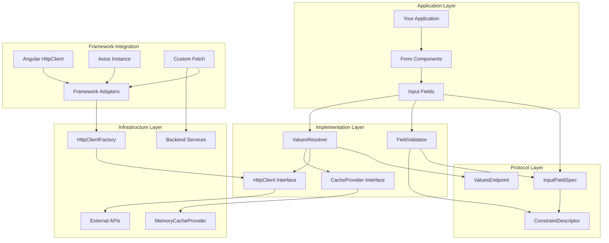
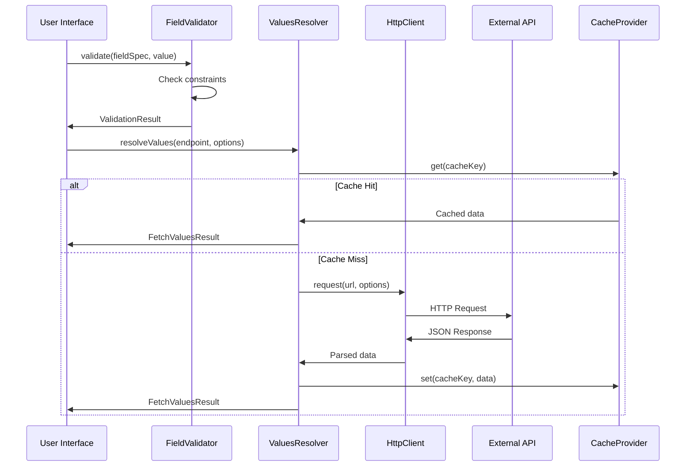
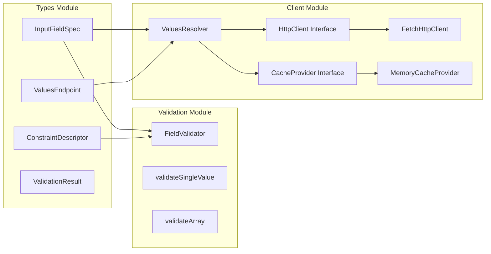

# Architecture Overview

## 🏗️ System Architecture Diagram



## 🔄 Data Flow Diagram



## 🔌 Framework Integration Strategy

### HTTP Client Injection Architecture

The v2.0 architecture introduces a sophisticated HTTP client injection system that preserves existing framework infrastructure:

#### Design Principles

1. **Framework Agnostic Core**: The core validation logic never directly makes HTTP calls
2. **Adapter Pattern**: Framework-specific adapters translate between our interface and framework HTTP clients
3. **Interceptor Preservation**: Existing authentication, logging, and error handling interceptors continue to work
4. **Zero Breaking Changes**: Existing HTTP configurations are preserved

#### HTTP Client Factory

```typescript
// Automatic detection and adaptation
const httpClient = HttpClientFactory.createAngularAdapter(angularHttpClient);
const httpClient = HttpClientFactory.createAxiosAdapter(axiosInstance);
const httpClient = HttpClientFactory.createFetchAdapter(customConfig);
```

#### Benefits for Frontend Teams

- **Angular Teams**: Use Angular's HttpClient with all interceptors intact
- **React Teams**: Use existing Axios configurations without modification  
- **Vue Teams**: Integrate with existing HTTP client setups
- **Legacy Teams**: Custom fetch configuration with interceptors

### Cache Provider Integration

Similar adapter pattern for cache systems:

```typescript
// Framework cache integration
const cache = new FrameworkCacheAdapter(existingCacheSystem);
const cache = new MemoryCacheProvider(); // Default implementation
```

### Dependency Injection Examples

#### Angular Service
```typescript
@Injectable()
export class FieldValidationService {
  constructor(private httpClient: HttpClient) {
    const adapter = HttpClientFactory.createAngularAdapter(httpClient);
    this.valuesResolver = new ValuesResolver(adapter, cache);
  }
}
```

#### React Hook
```typescript
function useFieldValidation() {
  const httpClient = useMemo(() => 
    HttpClientFactory.createAxiosAdapter(axiosInstance), []
  );
  const valuesResolver = useMemo(() => 
    new ValuesResolver(httpClient, cache), []
  );
}
```

